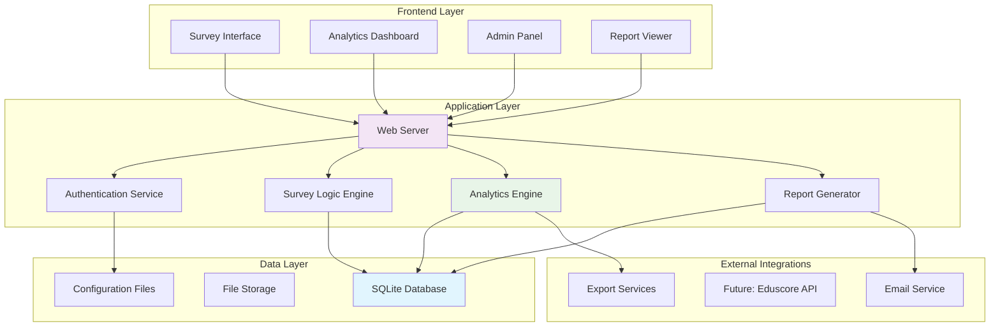

# Technical Architecture - Eduscore Feedback System

## System Overview

The feedback system is designed as a standalone web application with local data storage, built for scalability and future integration with Eduscore. The architecture prioritizes data security, analytical capabilities, and user experience.

### Architecture Principles
- **Local-first**: SQLite database for data sovereignty and compliance
- **Web-based**: Cross-platform accessibility via browser
- **Modular**: Component-based design for easy maintenance
- **Scalable**: Designed to handle team growth and increased data volume
- **Secure**: Role-based access and data anonymization options

---

## System Architecture Diagram



---

## Database Design

### Core Schema

```sql
-- User and authentication management
CREATE TABLE users (
    id INTEGER PRIMARY KEY AUTOINCREMENT,
    email TEXT UNIQUE NOT NULL,
    role TEXT NOT NULL CHECK (role IN ('admin', 'manager', 'sales')),
    name TEXT NOT NULL,
    department TEXT,
    hire_date DATE,
    is_active BOOLEAN DEFAULT 1,
    created_at TIMESTAMP DEFAULT CURRENT_TIMESTAMP
);

-- Survey configuration and versioning
CREATE TABLE surveys (
    id INTEGER PRIMARY KEY AUTOINCREMENT,
    name TEXT NOT NULL,
    description TEXT,
    target_role TEXT NOT NULL,
    version INTEGER DEFAULT 1,
    is_active BOOLEAN DEFAULT 1,
    created_at TIMESTAMP DEFAULT CURRENT_TIMESTAMP,
    updated_at TIMESTAMP DEFAULT CURRENT_TIMESTAMP
);

-- Question bank with metadata
CREATE TABLE questions (
    id INTEGER PRIMARY KEY AUTOINCREMENT,
    survey_id INTEGER NOT NULL,
    section TEXT NOT NULL,
    question_text TEXT NOT NULL,
    question_type TEXT NOT NULL CHECK (question_type IN ('likert', 'multiple_choice', 'text', 'ranking', 'percentage')),
    question_order INTEGER NOT NULL,
    is_required BOOLEAN DEFAULT 1,
    options JSON, -- For multiple choice and ranking questions
    validation_rules JSON,
    analysis_tags TEXT, -- For categorizing during analysis
    FOREIGN KEY (survey_id) REFERENCES surveys(id)
);

-- Individual survey responses
CREATE TABLE responses (
    id INTEGER PRIMARY KEY AUTOINCREMENT,
    survey_id INTEGER NOT NULL,
    user_id INTEGER,
    session_id TEXT NOT NULL, -- For anonymous responses
    is_anonymous BOOLEAN DEFAULT 0,
    started_at TIMESTAMP DEFAULT CURRENT_TIMESTAMP,
    completed_at TIMESTAMP,
    is_complete BOOLEAN DEFAULT 0,
    response_time_seconds INTEGER,
    FOREIGN KEY (survey_id) REFERENCES surveys(id),
    FOREIGN KEY (user_id) REFERENCES users(id)
);

-- Individual answer storage
CREATE TABLE answers (
    id INTEGER PRIMARY KEY AUTOINCREMENT,
    response_id INTEGER NOT NULL,
    question_id INTEGER NOT NULL,
    answer_value TEXT, -- JSON for complex answers
    answer_numeric REAL, -- For numerical analysis
    confidence_score INTEGER, -- Optional self-assessment
    created_at TIMESTAMP DEFAULT CURRENT_TIMESTAMP,
    FOREIGN KEY (response_id) REFERENCES responses(id),
    FOREIGN KEY (question_id) REFERENCES questions(id)
);

-- Pre-computed analytics for performance
CREATE TABLE analytics_cache (
    id INTEGER PRIMARY KEY AUTOINCREMENT,
    metric_name TEXT NOT NULL,
    metric_value JSON NOT NULL,
    filters JSON, -- What filters were applied
    computed_at TIMESTAMP DEFAULT CURRENT_TIMESTAMP,
    expires_at TIMESTAMP,
    INDEX(metric_name, computed_at)
);

-- Action items derived from analysis
CREATE TABLE action_items (
    id INTEGER PRIMARY KEY AUTOINCREMENT,
    title TEXT NOT NULL,
    description TEXT,
    priority TEXT CHECK (priority IN ('high', 'medium', 'low')),
    category TEXT, -- e.g., 'process', 'training', 'technology'
    assigned_to INTEGER,
    status TEXT DEFAULT 'open' CHECK (status IN ('open', 'in_progress', 'completed', 'cancelled')),
    due_date DATE,
    created_from_response_id INTEGER,
    created_at TIMESTAMP DEFAULT CURRENT_TIMESTAMP,
    updated_at TIMESTAMP DEFAULT CURRENT_TIMESTAMP,
    FOREIGN KEY (assigned_to) REFERENCES users(id),
    FOREIGN KEY (created_from_response_id) REFERENCES responses(id)
);

-- Audit trail for all data changes
CREATE TABLE audit_log (
    id INTEGER PRIMARY KEY AUTOINCREMENT,
    table_name TEXT NOT NULL,
    record_id INTEGER NOT NULL,
    action TEXT NOT NULL CHECK (action IN ('INSERT', 'UPDATE', 'DELETE')),
    old_values JSON,
    new_values JSON,
    user_id INTEGER,
    timestamp TIMESTAMP DEFAULT CURRENT_TIMESTAMP,
    FOREIGN KEY (user_id) REFERENCES users(id)
);
```

### Indexes for Performance

```sql
-- Response analysis indexes
CREATE INDEX idx_responses_survey_date ON responses(survey_id, completed_at);
CREATE INDEX idx_answers_response_question ON answers(response_id, question_id);
CREATE INDEX idx_users_role_active ON users(role, is_active);

-- Analytics indexes
CREATE INDEX idx_analytics_metric_date ON analytics_cache(metric_name, computed_at);
CREATE INDEX idx_action_items_status_priority ON action_items(status, priority);

-- Audit indexes
CREATE INDEX idx_audit_table_date ON audit_log(table_name, timestamp);
```

---

## Application Components

### 1. Survey Interface Component

**Purpose**: Responsive survey form with intelligent question flow  
**Technology**: HTML5, CSS3, JavaScript (Vanilla or lightweight framework)

**Key Features**:
- Progressive question loading
- Auto-save functionality
- Input validation and guidance
- Accessibility compliance (WCAG 2.1)
- Mobile-responsive design

**Technical Specifications**:
```javascript
// Survey state management
class SurveyManager {
    constructor(surveyId, sessionId) {
        this.surveyId = surveyId;
        this.sessionId = sessionId;
        this.currentSection = 0;
        this.responses = new Map();
        this.autoSaveInterval = 30000; // 30 seconds
    }
    
    // Auto-save implementation
    autoSave() {
        setInterval(() => {
            this.saveProgress();
        }, this.autoSaveInterval);
    }
    
    // Question validation
    validateSection(sectionData) {
        // Implementation for real-time validation
    }
}
```

### 2. Analytics Engine

**Purpose**: Real-time data processing and insight generation  
**Technology**: Python/Node.js with statistical libraries

**Core Modules**:

```python
# Statistical analysis module
class StatisticalAnalyzer:
    def __init__(self, db_connection):
        self.db = db_connection
        
    def calculate_correlations(self, response_data, performance_data):
        """Correlate survey responses with enrollment performance"""
        pass
    
    def segment_analysis(self, grouping_criteria):
        """Analyze responses by role, department, performance level"""
        pass
    
    def trend_analysis(self, time_period):
        """Identify trends over time"""
        pass

# Insight generation module
class InsightGenerator:
    def __init__(self, analyzer):
        self.analyzer = analyzer
        
    def generate_priority_matrix(self, pain_points):
        """Create impact vs. effort matrix for identified issues"""
        pass
    
    def suggest_action_items(self, analysis_results):
        """Generate actionable recommendations"""
        pass
```

### 3. Dashboard Component

**Purpose**: Interactive visualization of survey results and insights  
**Technology**: Chart.js or D3.js for visualizations

**Dashboard Sections**:
- **Overview Metrics**: Response rates, completion status, key trends
- **Comparative Analysis**: Manager vs. Sales perspectives
- **Priority Matrix**: Impact vs. Effort visualization
- **Action Items Tracker**: Implementation progress monitoring

**Visualization Examples**:
```javascript
// Pain point priority matrix
const priorityMatrix = {
    type: 'scatter',
    data: {
        datasets: [{
            label: 'Pain Points',
            data: painPoints.map(point => ({
                x: point.impact_score,
                y: point.effort_required,
                label: point.description
            }))
        }]
    },
    options: {
        scales: {
            x: { title: { display: true, text: 'Impact on Enrollments' }},
            y: { title: { display: true, text: 'Effort to Resolve' }}
        }
    }
};
```

### 4. Report Generator

**Purpose**: Automated report creation and distribution  
**Technology**: Template engine with PDF generation capability

**Report Types**:
- **Executive Summary**: High-level insights for leadership
- **Detailed Analysis**: Comprehensive findings with recommendations
- **Action Plan**: Prioritized implementation roadmap
- **Progress Reports**: Tracking improvement over time

---

## Security & Privacy

### Data Protection Measures

**1. Anonymous Response Handling**
```sql
-- Anonymous session management
CREATE VIEW anonymous_responses AS 
SELECT r.id, r.survey_id, r.session_id, r.completed_at,
       'ANONYMOUS' as user_identifier
FROM responses r 
WHERE r.is_anonymous = 1;
```

**2. Role-Based Access Control**
```javascript
const accessControl = {
    admin: ['all_surveys', 'user_management', 'system_config'],
    manager: ['team_responses', 'analytics_dashboard', 'action_items'],
    sales: ['own_responses', 'team_summaries']
};
```

**3. Data Anonymization**
- Configurable anonymization for sensitive responses
- Hash-based session IDs for anonymous tracking
- Automated PII detection and masking

### Backup & Recovery

**1. Automated Backups**
```bash
# Daily backup script
#!/bin/bash
DB_PATH="/app/data/feedback_system.db"
BACKUP_DIR="/app/backups"
DATE=$(date +%Y%m%d_%H%M%S)

sqlite3 $DB_PATH ".backup $BACKUP_DIR/backup_$DATE.db"
```

**2. Data Export Capabilities**
- CSV export for external analysis
- JSON export for data migration
- Encrypted backups for sensitive data

---

## Performance Optimization

### Database Optimization

**1. Query Optimization**
```sql
-- Materialized view for common analytics
CREATE VIEW response_summary AS
SELECT 
    s.name as survey_name,
    u.role,
    COUNT(r.id) as response_count,
    AVG(r.response_time_seconds) as avg_completion_time,
    DATE(r.completed_at) as response_date
FROM responses r
JOIN surveys s ON r.survey_id = s.id
LEFT JOIN users u ON r.user_id = u.id
WHERE r.is_complete = 1
GROUP BY s.id, u.role, DATE(r.completed_at);
```

**2. Caching Strategy**
- Analytics results cached for 1 hour
- Survey configurations cached until modified
- User session data cached in memory

### Application Performance

**1. Lazy Loading**
- Survey questions loaded progressively
- Analytics computed on-demand with caching
- Large reports generated asynchronously

**2. Resource Optimization**
- Minified CSS/JavaScript for production
- Image optimization for dashboard charts
- Gzip compression for API responses

---

## Integration Capabilities

### Future Eduscore Integration

**1. API Design**
```javascript
// RESTful API endpoints for future integration
const endpoints = {
    '/api/surveys/{id}/responses': 'POST', // Submit survey responses
    '/api/analytics/enrollment-correlation': 'GET', // Get performance correlations
    '/api/action-items': 'GET, POST, PUT', // Manage action items
    '/api/reports/{type}': 'GET' // Generate reports
};
```

**2. Data Synchronization**
```python
class EduscoreSync:
    def __init__(self, eduscore_api_key):
        self.api_key = eduscore_api_key
        
    def sync_user_performance(self, date_range):
        """Sync enrollment data for correlation analysis"""
        pass
        
    def push_action_items(self, action_items):
        """Create tasks in Eduscore based on feedback"""
        pass
```

### Export Integrations

**1. Business Intelligence Tools**
- Tableau connector for advanced visualization
- Power BI data export format
- Google Analytics integration for web metrics

**2. Communication Tools**
- Slack integration for action item notifications
- Email automation for report distribution
- Microsoft Teams integration for team updates

---

## Deployment Architecture

### Local Deployment

**1. Standalone Application**
```yaml
# Docker Compose configuration
version: '3.8'
services:
  feedback-app:
    build: .
    ports:
      - "8080:8080"
    volumes:
      - ./data:/app/data
      - ./config:/app/config
    environment:
      - NODE_ENV=production
      - DB_PATH=/app/data/feedback.db
```

**2. System Requirements**
- **Minimum**: 2GB RAM, 10GB storage, 2 CPU cores
- **Recommended**: 4GB RAM, 50GB storage, 4 CPU cores
- **Operating System**: Windows 10+, macOS 10.14+, Ubuntu 18.04+

### Scalability Considerations

**1. Horizontal Scaling**
- Load balancer for multiple application instances
- Database connection pooling
- Session management via Redis (optional)

**2. Vertical Scaling**
- Database partitioning by survey/date
- Analytics processing optimization
- Memory usage monitoring and optimization

---

## Monitoring & Maintenance

### Application Monitoring

**1. Health Checks**
```javascript
// System health monitoring
const healthCheck = {
    database: () => testDBConnection(),
    diskSpace: () => checkAvailableSpace(),
    responseTime: () => measureAverageResponseTime(),
    errorRate: () => calculateErrorPercentage()
};
```

**2. Performance Metrics**
- Response time monitoring
- Database query performance
- User session analytics
- Error logging and alerting

### Maintenance Procedures

**1. Regular Maintenance**
- Weekly database optimization
- Monthly backup verification
- Quarterly security updates
- Annual system performance review

**2. Data Retention Policy**
- Survey responses: 3 years
- Analytics cache: 6 months
- Audit logs: 5 years
- User sessions: 30 days

---

*Document Version: 1.0*  
*Last Updated: May 30, 2025*