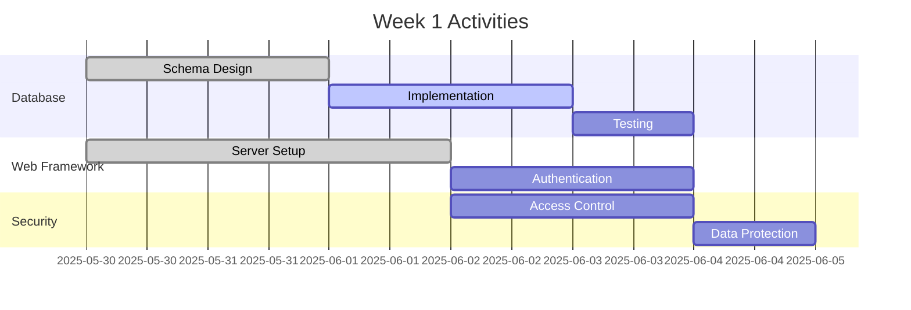
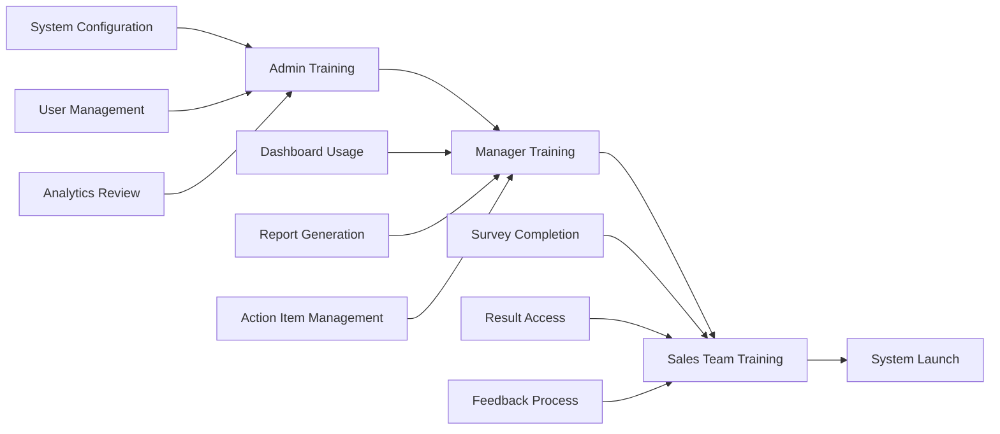
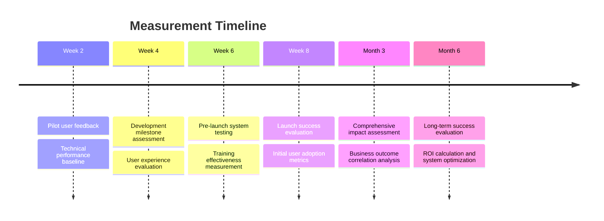
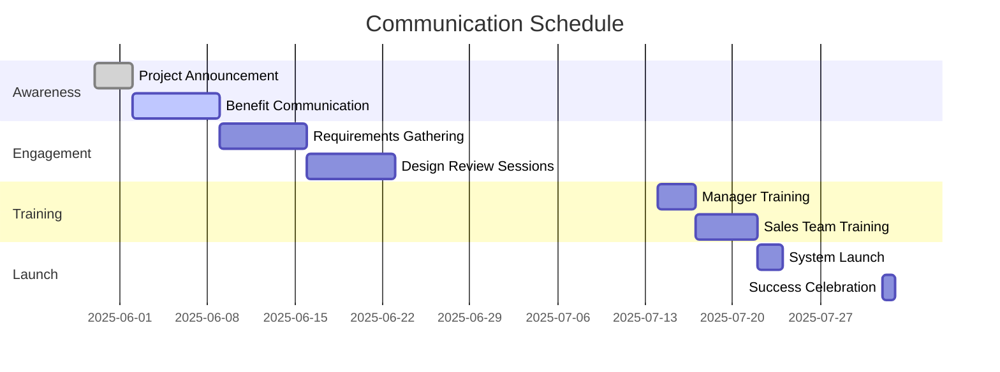
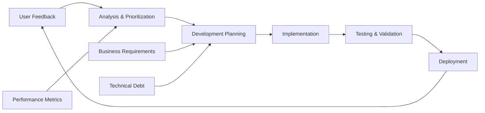

# Implementation Plan - Eduscore Feedback System

## Project Timeline Overview

**Total Duration**: 8 weeks  
**Team Structure**: Medium team (15-30 people, 4-6 managers, 20-25 sales reps)  
**Project Approach**: Agile with weekly sprints and continuous feedback integration

### Implementation Philosophy
- **Iterative Development**: Build core functionality first, enhance with advanced features
- **User-Centric Design**: Continuous feedback from pilot users throughout development
- **Risk Mitigation**: Parallel development tracks to minimize dependencies
- **Change Management**: Structured communication and training approach

---

## Phase-by-Phase Implementation

### Phase 1: Foundation & Setup (Weeks 1-2)

#### **Week 1: Infrastructure & Database Design**

**Objectives**:
- Set up development environment
- Implement core database schema
- Create basic web application framework
- Establish security protocols

**Deliverables**:
- ✅ SQLite database with complete schema implementation
- ✅ Basic web server setup with authentication framework
- ✅ Security measures: role-based access, data encryption
- ✅ Development and testing environment configuration

**Key Activities**:


**Success Criteria**:
- Database passes all schema validation tests
- Authentication system handles role-based access (admin, manager, sales)
- Basic web interface loads successfully
- Security audit checklist 100% complete

#### **Week 2: Core Survey Interface**

**Objectives**:
- Develop responsive survey interface
- Implement question logic and validation
- Create auto-save functionality
- Begin pilot user interface testing

**Deliverables**:
- ✅ Complete survey interface with all question types
- ✅ Progressive question loading system
- ✅ Auto-save functionality (30-second intervals)
- ✅ Mobile-responsive design
- ✅ Input validation and error handling

**Key Activities**:
- Frontend development using modern web standards
- Question flow logic implementation
- User experience testing with 2-3 pilot users
- Cross-browser compatibility testing

**Success Criteria**:
- Survey completes successfully on desktop and mobile
- Auto-save functionality works reliably
- Validation catches common input errors
- Average completion time meets 12-15 minute target

---

### Phase 2: Core Functionality (Weeks 3-4)

#### **Week 3: Analytics Engine Development**

**Objectives**:
- Build statistical analysis capabilities
- Implement correlation analysis features
- Create basic dashboard framework
- Develop insight generation algorithms

**Deliverables**:
- ✅ Statistical analysis module with correlation calculations
- ✅ Basic analytics dashboard with key metrics
- ✅ Data visualization components
- ✅ Automated insight generation for common patterns

**Key Activities**:
```python
# Core analytics capabilities to implement
analytics_modules = {
    'statistical_analysis': [
        'correlation_matrix',
        'trend_analysis', 
        'segmentation_analysis'
    ],
    'insight_generation': [
        'pain_point_prioritization',
        'action_item_suggestions',
        'performance_correlations'
    ],
    'visualization': [
        'priority_matrix_charts',
        'trend_graphs',
        'comparison_dashboards'
    ]
}
```

**Success Criteria**:
- Analytics engine processes sample data correctly
- Dashboard displays meaningful visualizations
- Correlation analysis identifies statistically significant relationships
- Insight generation produces actionable recommendations

#### **Week 4: Report Generation & Advanced Features**

**Objectives**:
- Implement comprehensive reporting system
- Add advanced diagnostic capabilities
- Create export functionality
- Enhance user interface based on pilot feedback

**Deliverables**:
- ✅ Executive summary report generation
- ✅ Detailed analysis reports with recommendations
- ✅ CSV/JSON export capabilities
- ✅ Advanced diagnostic question logic
- ✅ Action item tracking system

**Key Activities**:
- Report template development
- PDF generation capability
- Advanced question branching logic
- User interface refinements
- Performance optimization

**Success Criteria**:
- Reports generate automatically with current data
- Export functions work for all data types
- Advanced diagnostic questions provide deeper insights
- System performance meets response time requirements

---

### Phase 3: Advanced Features & Integration (Weeks 5-6)

#### **Week 5: Advanced Analytics & Predictive Features**

**Objectives**:
- Implement predictive analytics capabilities
- Add advanced visualization options
- Create automated alert system
- Enhance data analysis algorithms

**Deliverables**:
- ✅ Predictive models for enrollment risk identification
- ✅ Advanced data visualization dashboard
- ✅ Automated alerting for critical insights
- ✅ Machine learning models for pattern recognition
- ✅ Comparative analysis tools

**Advanced Analytics Features**:
```javascript
const advancedAnalytics = {
    predictiveModels: {
        enrollmentRisk: 'Identify at-risk prospects based on engagement patterns',
        performanceTrends: 'Predict team performance based on feedback scores',
        systemAdoption: 'Forecast technology adoption success rates'
    },
    
    machineLearning: {
        textAnalysis: 'Analyze open-ended responses for sentiment and themes',
        patternRecognition: 'Identify hidden correlations in response data',
        anomalyDetection: 'Flag unusual response patterns for investigation'
    }
};
```

**Success Criteria**:
- Predictive models show >70% accuracy on historical data
- Advanced visualizations provide actionable insights
- Automated alerts trigger appropriately for critical issues
- Machine learning models improve insight quality

#### **Week 6: Integration Planning & API Development**

**Objectives**:
- Develop API endpoints for future Eduscore integration
- Create data synchronization capabilities
- Implement backup and recovery systems
- Prepare for production deployment

**Deliverables**:
- ✅ RESTful API with comprehensive endpoints
- ✅ Data synchronization framework
- ✅ Automated backup system
- ✅ Disaster recovery procedures
- ✅ Production deployment preparation

**API Endpoints**:
```yaml
# API specification for future integrations
endpoints:
  surveys:
    - GET /api/surveys: List available surveys
    - POST /api/surveys/{id}/responses: Submit survey responses
    - GET /api/surveys/{id}/analytics: Get survey analytics
  
  analytics:
    - GET /api/analytics/correlations: Enrollment correlation data
    - GET /api/analytics/trends: Performance trend analysis
    - GET /api/analytics/predictions: Predictive insights
  
  integration:
    - POST /api/integration/eduscore/sync: Sync with Eduscore data
    - GET /api/integration/export/{format}: Export data in various formats
```

**Success Criteria**:
- API endpoints respond correctly to all test scenarios
- Data synchronization works with sample external systems
- Backup system creates and verifies daily backups
- Production environment is fully configured and tested

---

### Phase 4: Deployment & Optimization (Weeks 7-8)

#### **Week 7: Production Deployment & Training**

**Objectives**:
- Deploy system to production environment
- Conduct comprehensive user training
- Implement monitoring and alerting
- Begin full team rollout

**Deliverables**:
- ✅ Production system fully deployed and operational
- ✅ Comprehensive training materials and sessions
- ✅ System monitoring and alerting in place
- ✅ User documentation and help system
- ✅ Initial data collection from full team

**Training Program**:


**Training Schedule**:
- **Day 1-2**: Administrator training (system configuration, user management)
- **Day 3-4**: Manager training (dashboard usage, report interpretation)
- **Day 5-7**: Sales team training (survey completion, result access)

**Success Criteria**:
- 100% of team members complete training successfully
- Production system handles full team load without issues
- Monitoring systems detect and alert on any problems
- Initial survey responses begin flowing into the system

#### **Week 8: Optimization & Analysis**

**Objectives**:
- Collect and analyze initial feedback data
- Optimize system performance based on usage patterns
- Generate first comprehensive analysis report
- Plan ongoing improvement initiatives

**Deliverables**:
- ✅ First comprehensive feedback analysis report
- ✅ System performance optimization based on real usage
- ✅ Initial action plan based on survey results
- ✅ Ongoing maintenance and improvement roadmap
- ✅ Success metrics evaluation

**Initial Analysis Focus Areas**:
1. **Response Quality Assessment**
   - Completion rates by role and department
   - Response time analysis
   - Data quality and consistency checks

2. **Immediate Insights Generation**
   - Top pain points identification
   - Quick wins opportunity assessment
   - Priority matrix creation for improvement initiatives

3. **System Performance Review**
   - User experience feedback
   - Technical performance metrics
   - Scalability assessment

**Success Criteria**:
- Initial analysis reveals actionable insights
- System performance meets all requirements under full load
- First set of improvement recommendations ready for implementation
- Stakeholder satisfaction with system capabilities

---

## Resource Requirements

### Team Composition

**Core Development Team**:
- **Project Manager** (1.0 FTE) - Overall coordination and stakeholder management
- **Full-Stack Developer** (1.0 FTE) - Web application development
- **Database Specialist** (0.5 FTE) - Database design and optimization
- **Data Analyst** (0.5 FTE) - Analytics algorithm development
- **UX/UI Designer** (0.5 FTE) - User interface design and testing
- **QA Tester** (0.5 FTE) - Quality assurance and user acceptance testing

**Subject Matter Experts**:
- **Admissions Manager** (0.25 FTE) - Requirements validation and testing
- **Sales Representative** (0.25 FTE) - User experience feedback
- **IT Administrator** (0.25 FTE) - System deployment and maintenance planning

### Technology Requirements

**Development Environment**:
```yaml
hardware:
  development_machines: 2x laptops with 16GB RAM, SSD storage
  test_server: Virtual machine with 8GB RAM, 100GB storage
  
software:
  database: SQLite (development), PostgreSQL (production option)
  backend: Node.js/Express or Python/Flask
  frontend: HTML5, CSS3, JavaScript (vanilla or React)
  analytics: Python with pandas, numpy, scikit-learn
  visualization: Chart.js or D3.js
  
tools:
  version_control: Git with GitHub/GitLab
  project_management: Jira or Trello
  communication: Slack or Microsoft Teams
```

**Production Environment**:
- **Server**: 4GB RAM, 50GB SSD, 2 CPU cores minimum
- **Backup Storage**: 100GB cloud storage for backups
- **SSL Certificate**: For secure HTTPS communication
- **Monitoring Tools**: Application performance monitoring

### Budget Estimation

| Category | Item | Cost (USD) | Duration |
|----------|------|------------|----------|
| **Personnel** | Development team (3.5 FTE × 8 weeks) | $35,000 | One-time |
| **Technology** | Development tools and licenses | $2,000 | One-time |
| **Infrastructure** | Cloud hosting and services | $500 | Monthly |
| **Training** | Training materials and sessions | $1,500 | One-time |
| **Contingency** | 15% buffer for unexpected costs | $5,850 | One-time |
| **Total** | **Project Total** | **$44,850** | **Initial** |

**Ongoing Costs** (Annual):
- Infrastructure: $6,000
- Maintenance and updates: $12,000
- Training for new team members: $2,000
- **Annual Total**: $20,000

---

## Risk Management

### Risk Assessment Matrix

| Risk | Probability | Impact | Mitigation Strategy |
|------|-------------|---------|-------------------|
| **Low survey adoption** | Medium | High | Anonymous options, management endorsement, clear benefit communication |
| **Technical integration challenges** | Low | Medium | Modular architecture, comprehensive testing, fallback options |
| **Data quality issues** | Medium | Medium | Validation rules, follow-up mechanisms, pilot testing |
| **Scope creep** | High | Medium | Clear requirements documentation, change control process |
| **Team resistance to change** | Medium | High | Change management program, early stakeholder involvement |
| **Performance issues with large datasets** | Low | Medium | Database optimization, caching strategy, load testing |

### Mitigation Strategies

#### **1. User Adoption Risks**

**Low Survey Participation**:
- **Prevention**: Clear communication about benefits, anonymous options
- **Detection**: Real-time participation tracking dashboard
- **Response**: Targeted follow-up, additional incentives, management reinforcement

**Poor Data Quality**:
- **Prevention**: Input validation, clear question design, pilot testing
- **Detection**: Automated quality checks, response pattern analysis
- **Response**: Follow-up clarification, question refinement, training updates

#### **2. Technical Risks**

**System Performance Issues**:
- **Prevention**: Load testing, database optimization, caching implementation
- **Detection**: Performance monitoring, user feedback tracking
- **Response**: Immediate optimization, infrastructure scaling, code refactoring

**Data Security Breaches**:
- **Prevention**: Encryption, access controls, security audits
- **Detection**: Security monitoring, anomaly detection
- **Response**: Incident response plan, data recovery procedures, stakeholder notification

#### **3. Project Management Risks**

**Timeline Delays**:
- **Prevention**: Realistic scheduling, buffer time allocation, parallel workstreams
- **Detection**: Weekly progress reviews, milestone tracking
- **Response**: Resource reallocation, scope adjustment, stakeholder communication

**Budget Overruns**:
- **Prevention**: Detailed cost estimation, regular budget reviews
- **Detection**: Weekly expense tracking, variance analysis
- **Response**: Cost optimization, scope prioritization, additional funding requests

---

## Success Metrics & KPIs

### Phase-Specific Success Metrics

#### **Phase 1-2: Development Success**
- **Code Quality**: >90% test coverage, <5% bug rate
- **Performance**: Page load times <2 seconds, API response <500ms
- **User Experience**: Completion rate >85% in pilot testing

#### **Phase 3-4: Deployment Success**
- **System Reliability**: >99% uptime, <1 hour mean time to recovery
- **User Adoption**: >90% participation rate within 2 weeks
- **Data Quality**: <5% incomplete responses, >95% validation pass rate

### Long-term Success Metrics

#### **System Effectiveness (3-month evaluation)**

**Quantitative Metrics**:
```yaml
adoption_metrics:
  participation_rate: ">90%"
  completion_rate: ">85%"
  time_to_complete: "<15 minutes average"
  
quality_metrics:
  data_completeness: ">95%"
  response_consistency: ">90%"
  insight_accuracy: ">80%"
  
business_impact:
  actionable_insights_generated: ">20 per survey cycle"
  improvement_initiatives_launched: ">5 per quarter"
  enrollment_conversion_improvement: ">10% correlated improvements"
```

**Qualitative Metrics**:
- User satisfaction scores (target: >8/10)
- System perceived value (target: >85% find valuable)
- Change implementation success (target: >70% of recommendations acted upon)

#### **Business Impact Assessment**

**Primary Outcomes**:
1. **Process Efficiency Improvements**
   - Reduction in Excel usage for lead tracking
   - Decrease in manual workarounds
   - Improved data accessibility and reporting

2. **Enrollment Performance Correlation**
   - Identification of high-impact improvement areas
   - Correlation between feedback implementation and enrollment increases
   - Team performance optimization insights

3. **Organizational Learning**
   - Enhanced manager coaching capabilities
   - Data-driven decision making adoption
   - Continuous improvement culture development

### Measurement Framework

#### **Data Collection Schedule**


#### **Reporting Cadence**
- **Weekly**: Development progress, technical metrics
- **Monthly**: User adoption, system performance, preliminary insights
- **Quarterly**: Business impact assessment, ROI analysis, strategic recommendations

---

## Change Management Strategy

### Communication Plan

#### **Stakeholder Communication Matrix**

| Stakeholder Group | Communication Method | Frequency | Key Messages |
|-------------------|---------------------|-----------|---------------|
| **Executive Leadership** | Executive briefings, email updates | Bi-weekly | ROI, strategic impact, resource requirements |
| **Admissions Managers** | Team meetings, demo sessions | Weekly | Process improvements, team insights, action planning |
| **Sales Representatives** | Team meetings, training sessions | Weekly | Benefits, ease of use, feedback incorporation |
| **IT Department** | Technical briefings, documentation | As needed | System requirements, security, maintenance |

#### **Communication Timeline**


### Training Strategy

#### **Multi-Modal Training Approach**

**1. Role-Specific Training Modules**
```yaml
administrator_training:
  duration: "4 hours"
  format: "Hands-on workshop"
  topics: ["System configuration", "User management", "Report generation", "Troubleshooting"]
  
manager_training:
  duration: "3 hours" 
  format: "Interactive session"
  topics: ["Dashboard navigation", "Insight interpretation", "Action planning", "Team coaching"]
  
sales_training:
  duration: "2 hours"
  format: "Quick start session"
  topics: ["Survey completion", "Result access", "Feedback process", "Technical support"]
```

**2. Training Materials**
- **Video Tutorials**: Screen recordings for each major function
- **Quick Reference Guides**: Printable cards for common tasks
- **Interactive Help**: In-system guidance and tooltips
- **FAQ Database**: Comprehensive question and answer repository

### Change Readiness Assessment

#### **Pre-Implementation Survey**
```yaml
readiness_factors:
  technology_comfort: "Rate comfort level with new technology tools"
  change_openness: "Assess openness to process changes"
  current_pain_points: "Identify motivation for improvement"
  support_expectations: "Understand training and support needs"
```

#### **Change Champion Network**
- **Manager Champions**: 2-3 managers to advocate and support adoption
- **Sales Champions**: 4-5 sales representatives to provide peer support
- **IT Champion**: 1 IT person for technical troubleshooting

---

## Post-Implementation Support

### Ongoing Maintenance Schedule

#### **Regular Maintenance Activities**

**Weekly Tasks**:
- System performance monitoring review
- Backup verification and testing
- User support ticket review and resolution
- Data quality assessment

**Monthly Tasks**:
- Security update application
- Database optimization and cleanup
- User feedback collection and analysis
- Performance optimization review

**Quarterly Tasks**:
- Comprehensive system health assessment
- User satisfaction survey
- Feature enhancement planning
- Training material updates

### Continuous Improvement Framework

#### **Feedback Loop Implementation**


#### **Enhancement Roadmap**

**Quarter 1 Post-Launch**:
- Advanced reporting features
- Additional question types
- Mobile app development planning

**Quarter 2**:
- Eduscore integration development
- Predictive analytics enhancement
- Advanced visualization features

**Quarter 3**:
- Machine learning model refinement
- Automated insight generation
- Third-party tool integrations

**Quarter 4**:
- Annual system review and optimization
- Strategic feature planning for next year
- ROI assessment and business case updates

---

## Conclusion

This implementation plan provides a comprehensive roadmap for delivering a sophisticated feedback system that addresses the critical challenges facing your admissions team. The 8-week timeline balances thoroughness with urgency, ensuring that you can begin collecting valuable insights quickly while building a robust foundation for long-term success.

### Key Success Factors

1. **Strong Leadership Support**: Executive endorsement and manager participation
2. **User-Centric Design**: Continuous feedback integration throughout development
3. **Technical Excellence**: Robust architecture with scalability and security
4. **Change Management**: Comprehensive training and communication strategy
5. **Continuous Improvement**: Ongoing optimization based on user feedback and business results

The modular approach allows for future enhancements and integrations while delivering immediate value through improved insight into your team's challenges and opportunities for enrollment growth.

---

*Document Version: 1.0*  
*Last Updated: May 30, 2025*