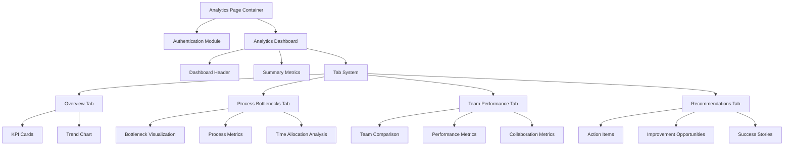
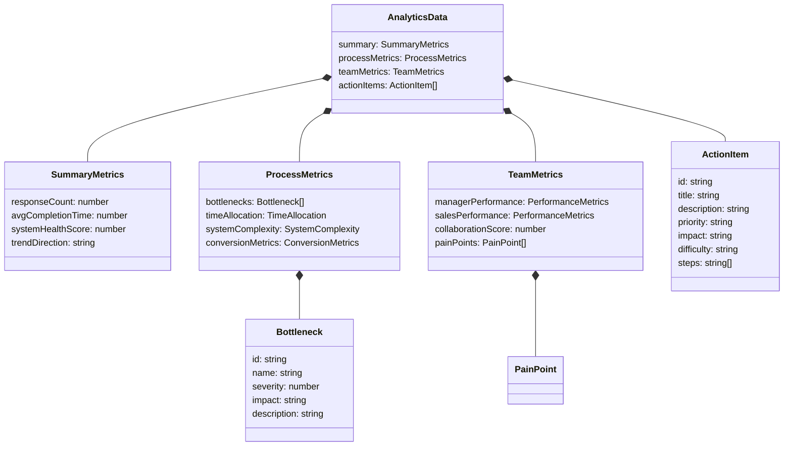

# Admissions Analytics System Refactoring Plan

After analyzing the current admissions analytics system, I've identified several areas for improvement. The system has grown into a monolithic structure with mixed concerns, making it difficult to maintain and extend. Let's create a comprehensive refactoring plan to transform it into a modular, actionable analytics dashboard.

## 1. Current State Analysis

### Code Structure Issues:
- **Monolithic Components**: Both the frontend (1200+ lines) and API route (1300+ lines) are excessively large
- **Mixed Concerns**: UI rendering, data processing, and business logic are intertwined
- **Redundant Data Transformations**: Similar calculations performed in multiple places
- **Hardcoded Values**: Authentication password ("uniat") and many business rules are hardcoded

### Data & Analytics Issues:
- **Metric Overload**: Too many metrics without clear hierarchy of importance
- **Weak Actionability**: Many visualizations are decorative rather than driving decisions
- **Disconnected Insights**: Metrics aren't organized around specific business questions
- **Poor Data Flow**: Complex transformation from survey responses to meaningful insights

## 2. Component Architecture Plan

Let's design a new modular architecture that breaks down the monolithic components into focused, maintainable pieces.



### Key Components:

1. **AnalyticsPage**: Main container, handles authentication state
2. **AuthModule**: Login form and authentication logic
3. **AnalyticsDashboard**: Overall dashboard layout and data fetching
4. **MetricCards**: Reusable component for displaying key metrics
5. **ProcessBottlenecks**: Visualization of process bottlenecks
6. **TeamPerformance**: Team comparison and metrics
7. **ActionableInsights**: Recommendations and action items
8. **ChartComponents**: Reusable chart components with consistent styling

## 3. Data Model Redesign

Let's redesign the analytics data model to focus on actionable insights rather than overwhelming metrics.



## 4. API Restructuring Plan

The API should be refactored into smaller, focused endpoints that handle specific aspects of the analytics:

1. **`/api/analytics/summary`**: Basic summary metrics
2. **`/api/analytics/process`**: Process bottlenecks and efficiency metrics
3. **`/api/analytics/team`**: Team performance and collaboration metrics
4. **`/api/analytics/recommendations`**: Action items and recommendations
5. **`/api/analytics/raw`**: Raw data for custom visualizations (optional)

Each endpoint will have a dedicated handler function focused on its specific concerns.

## 5. Business-Focused Metrics

Reorganize metrics around key business questions:

### 1. Process Efficiency
- **Where are prospects getting stuck?**
  - Stage conversion rates
  - Average time in each stage
  - Drop-off points in the funnel
  
- **How is time being allocated?**
  - Admin vs. sales time ratio
  - Time spent on different activities
  - Opportunity cost analysis

### 2. Team Performance
- **How effective are different team members?**
  - Conversion rates by team/person
  - Response times and follow-up consistency
  - Lead quality assessment
  
- **How well do teams collaborate?**
  - Handoff effectiveness
  - Information sharing metrics
  - Cross-team communication quality

### 3. System Impact
- **How is the system affecting productivity?**
  - Tool complexity score
  - Manual workaround prevalence
  - System reliability metrics
  
- **What is the ROI on system improvements?**
  - Time savings potential
  - Conversion improvement opportunity
  - Revenue impact estimates

## 6. Implementation Plan

### Phase 1: Code Separation and Refactoring
1. Split analytics page into modular components
2. Create shared UI components for consistency
3. Refactor API into separate logical endpoints
4. Implement proper authentication system

### Phase 2: Data Model Implementation
1. Implement new data models for analytics
2. Refactor data processing logic into dedicated services
3. Create mapping functions for legacy data
4. Add data validation and error handling

### Phase 3: Improved Visualizations
1. Implement focused, actionable charts
2. Add interactive filtering capabilities
3. Create drill-down functionality for detailed analysis
4. Develop printable/exportable reports

### Phase 4: User Experience Enhancements
1. Add guided analysis features
2. Implement user preferences for dashboard customization
3. Create alerts for critical metrics
4. Add annotation capabilities for team collaboration

## 7. Detailed Component File Structure

```
/src
  /app
    /analytics
      /page.tsx                   # Main container (< 100 lines)
      /components
        /AuthModule.tsx           # Authentication component
        /DashboardHeader.tsx      # Header with controls
        /MetricCard.tsx           # Reusable metric card
        /TabSystem.tsx            # Tab navigation
        /charts                   # Reusable chart components
          /BarChart.tsx
          /LineChart.tsx
          /FunnelChart.tsx
        /tabs                     # Tab content components
          /OverviewTab.tsx
          /ProcessTab.tsx
          /TeamTab.tsx
          /RecommendationsTab.tsx
    /api
      /analytics
        /route.ts                 # Main route handler (simplified)
        /[metric]
          /route.ts               # Dynamic metric routes
      /auth
        /route.ts                 # Authentication API
  /lib
    /analytics
      /processors                 # Data processing functions
        /summary.ts
        /process.ts
        /team.ts
        /recommendations.ts
      /utils                      # Utility functions
        /calculations.ts
        /formatting.ts
      /types.ts                   # Type definitions
      /constants.ts               # Configuration constants
```

## 8. Specific Metrics to Focus On

Based on the survey questions and objectives, these metrics will provide the most actionable insights:

1. **Lead Conversion Funnel**
   - Conversion rates between each stage
   - Time spent in each stage
   - Drop-off analysis by reason

2. **Time Allocation Analysis**
   - Administrative time percentage
   - Sales activity time percentage
   - Time lost to system inefficiencies

3. **System Complexity Impact**
   - Number of tools used
   - Impact of manual workarounds
   - Data quality and reliability scores

4. **Team Collaboration Effectiveness**
   - Information sharing quality
   - Handoff success rates
   - Cross-team communication metrics

5. **Actionable Recommendations**
   - Prioritized by impact and effort
   - Clear steps for implementation
   - Expected results metrics

This refactoring plan transforms the current monolithic analytics system into a modular, actionable dashboard that focuses on the most critical business metrics. By organizing around key business questions rather than technical data structures, the new system will help administrators identify bottlenecks, optimize processes, and make data-driven decisions.