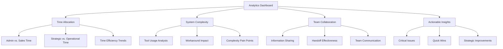

# Enhanced Analytics Refactoring Plan Analysis

After examining the existing survey questions in `src/lib/questions.ts` and the data processing in `src/app/api/analytics/route.ts`, I've evaluated how well the metrics proposed in section 8 of the refactoring plan align with our actual data capabilities.

## Alignment Analysis of Section 8 Metrics

### 1. Lead Conversion Funnel
**Status: PARTIALLY SUPPORTED**

We have some relevant data:
- Lead loss questions (161, 183, 270)
- Conversion stages question (364)
- Processing in the API for `leadConversionRate`

**Gaps:**
- Missing detailed conversion rates between specific pipeline stages
- No time tracking data for how long prospects spend in each stage
- Cannot create a complete stage-by-stage funnel analysis

### 2. Time Allocation Analysis
**Status: FULLY SUPPORTED**

We have excellent data coverage:
- Question 57: Manager time on system problems vs. strategic planning
- Question 172: Team time on data entry vs. sales activities
- Question 248: Individual time on administrative tasks vs. sales activities

The API correctly processes this into the `timeAllocation` object with adminTime, salesTime, and otherTime.

### 3. System Complexity Impact
**Status: FULLY SUPPORTED**

We have comprehensive data:
- Tools used (question 218)
- Manual workarounds (questions 131, 141, 290)
- Impact of system complexity (questions 151, 161)

The API processes this into the `systemComplexity` object with appropriate metrics.

### 4. Team Collaboration Effectiveness
**Status: FULLY SUPPORTED**

We have strong data coverage:
- Information sharing (question 322)
- Handoff quality (question 332)
- Communication gaps (question 342)
- Team coordination (questions 332, 354)

The API processes this into collaboration metrics within the `businessMetrics` object.

### 5. Actionable Recommendations
**Status: FULLY SUPPORTED**

The API includes functions like `generateSpecificRecommendations()` and `generateActionableInsights()` that create prioritized recommendations with action steps and impact assessments.

## Additional Metrics Our Data Could Support

Our survey data could support these additional metrics that aren't emphasized in the current plan:

1. **Data Quality Confidence**
   - Questions 69, 89 assess confidence in data quality
   - Could help identify trust issues in the system

2. **Training and Coaching Effectiveness**
   - Questions 99, 89 cover coaching data and missed opportunities
   - Would provide insights into staff development support

3. **Personal Productivity Barriers**
   - Questions 407, 426 on frustrations and tasks users would eliminate
   - Could identify specific productivity blockers

4. **System vs. Strategy Time Ratio**
   - Question 57 specifically asks about time on system problems vs. strategic planning
   - Key metric for management effectiveness

5. **Feature Gap Analysis**
   - Question 416 asks about desired features seen elsewhere
   - Could help prioritize enhancements based on competitive analysis

## Enhanced Refactoring Plan Recommendations

Based on this analysis, I recommend enhancing the refactoring plan as follows:

### 1. Dashboard Organization

Reorganize the dashboard around the data we actually have:

### 2. Refined Metrics Definitions

Replace section 8 of the refactoring plan with these more precise definitions:

1. **Time Allocation Dashboard**
   - Admin/Data Entry Time Percentage (from questions 172, 248)
   - Sales Activity Time Percentage (from questions 172, 248)
   - System Problems vs. Strategic Planning Ratio (from question 57)
   - Time Efficiency Score (derived from admin vs. sales time ratio)

2. **System Complexity Dashboard**
   - Tool Count Metric (from question 218)
   - Workaround Prevalence (from questions 131, 141, 290)
   - Excel Impact Score (from question 151)
   - Complexity Pain Points (derived from questions with system_complexity tag)

3. **Team Collaboration Dashboard**
   - Information Sharing Quality (from question 322)
   - Handoff Effectiveness (from question 332)
   - Manager-Team Communication Gap Analysis (from questions 342, 354)
   - Cross-Team Coordination Score (derived from collaboration questions)

4. **Productivity Barriers Dashboard** (new section)
   - Data Access Time (from question 310)
   - System Login Fragmentation (from question 258)
   - Feature Gap Analysis (from question 416)
   - Task Elimination Impact (from question 426)

5. **Actionable Recommendations**
   - Prioritized by impact on time allocation and complexity reduction
   - Categorized by difficulty and implementation timeframe
   - Linked to specific survey responses for context

### 3. Lead Conversion Metrics Adjustments

Since we have limited lead conversion data, revise this section to:

1. **Lead Management Insights** (instead of full funnel)
   - Lead Loss Frequency (from question 161)
   - Estimated Loss Percentage (from question 183)
   - Lead Tracking Confidence (from question 270)
   - Identified Conversion Blockers (from questions 364, 394)

### 4. Additional Data Collection Recommendations

Add a section recommending collection of:

1. **Pipeline Stage Data**
   - Time spent in each conversion stage
   - Conversion rates between specific stages
   - Reasons for drop-offs at each stage

2. **Outcome Metrics**
   - Actual conversion rates (not just self-reported)
   - Time to conversion
   - Revenue impact of process improvements

## Critical Analysis of Current Survey Questions

The current survey questions have these strengths and limitations:

### Strengths
- Comprehensive coverage of subjective experiences
- Good balance between quantitative and qualitative questions
- Strong focus on time allocation and administrative burden
- Effective capture of system complexity issues
- Solid coverage of collaboration and communication challenges

### Limitations
- Lack of objective performance metrics
- No tracking of actual conversion metrics through the pipeline
- Missing time-in-stage measurements for process analysis
- Limited ability to correlate system issues with business outcomes
- Reliance on self-reported data rather than system-captured metrics

## Conclusion

The proposed metrics in section 8 of the refactoring plan are generally well-aligned with our available survey data, with the exception of the detailed lead conversion funnel metrics. By implementing the recommendations above, we can create a more accurate and actionable analytics dashboard that maximizes insights from our current data while identifying areas for future data collection.