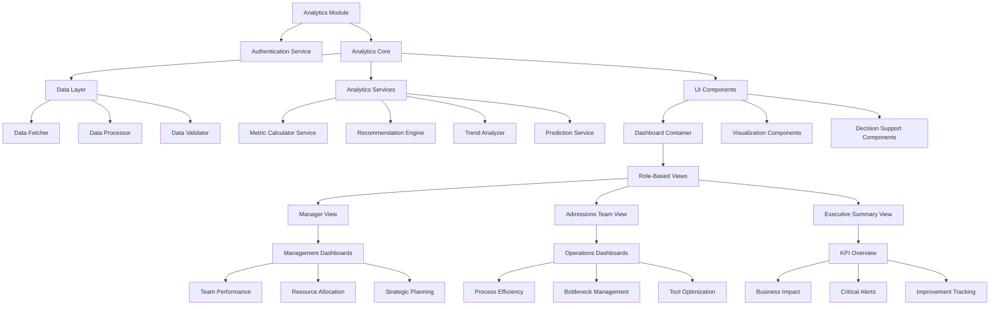
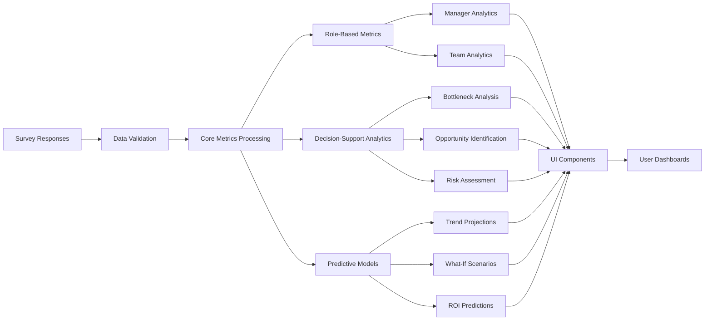

# Advanced Analytics Refactoring Plan: Data-Driven Decision Support System

## Executive Summary

After analyzing both previous plans alongside the actual survey questions, response data processing, and frontend implementation, I propose a data-driven decision support system that transforms the current analytics platform into an actionable business intelligence tool for the admissions process. This plan combines architectural improvements with data-validated metrics to create a truly useful analytics dashboard.

Rather than simply reporting metrics, this system will guide users toward specific actions, predict outcomes, and provide contextual decision support tailored to each stakeholder's role in the admissions process.

## 1. Current System Analysis

### 1.1 Technical Issues

- **Excessive Monolithic Structure**: Both API route (1398 lines) and frontend (1208 lines) are too large
- **Authentication Vulnerability**: Hardcoded password ("uniat") in frontend code
- **Data Transformation Inefficiency**: Multiple redundant calculations
- **Unclear Metric Definitions**: Many metrics lack clear methodologies for calculation
- **Poor Error Handling**: Minimal validation or error recovery
- **Missing Types**: Some interfaces are incomplete

### 1.2 Business Analytics Issues

- **Action-Insight Gap**: Metrics don't directly connect to specific actions
- **Role Confusion**: Metrics aren't tailored to specific user roles (managers vs. admissions staff)
- **Data Validity Concerns**: No confidence indicators for metrics with small sample sizes
- **Trend Analysis Weakness**: Limited historical tracking and prediction
- **Visual Information Overload**: Too many charts without clear hierarchy

### 1.3 Data Reality Assessment

Based on analysis of `src/lib/questions.ts` and `src/app/api/analytics/route.ts`, our data has specific strengths and limitations:

**Strong Data Areas:**
- Time allocation metrics (questions 57, 172, 248)
- System complexity measurements (questions 131, 141, 218, 290)
- Team collaboration (questions 322, 332, 342, 354)
- Personal productivity barriers (questions 407, 426)

**Limited Data Areas:**
- Lead funnel stage-by-stage conversion rates
- Detailed time-in-stage measurements
- ROI calculations for system improvements

## 2. Core Design Principles

The new analytics system will follow these principles:

1. **Action-Oriented**: Every metric leads to specific actions
2. **Role-Based**: Different views for different stakeholder roles
3. **Data-Validated**: Only show metrics with sufficient data quality
4. **Decision-Focused**: Organize around key decisions, not technical categories
5. **Context-Rich**: Provide benchmarks and trend context for every metric
6. **Visually Hierarchical**: Clear visual importance hierarchy
7. **Forward-Looking**: Predictive elements based on current trends

## 3. System Architecture

### 3.1 Component Architecture



### 3.2 Data Flow Architecture



## 4. Decision-Oriented Dashboard Structure

Unlike traditional category-based dashboards, our system organizes around key decisions that admissions leaders must make:

### 4.1 Manager Dashboard: "Where should I focus my team's efforts?"

This dashboard helps managers decide where to allocate resources and attention, using these fully-supported metrics:

1. **Time Allocation Analyzer**
   - Admin vs. Sales Time Distribution (from questions 172, 248)
   - System Problems vs. Strategic Planning Ratio (from question 57)
   - Time Efficiency Score with benchmarks and targets
   - **Decision Support**: Specific areas where time reallocation would yield highest returns

2. **Team Performance Optimizer**
   - Individual performance comparison (anonymized)
   - Information sharing effectiveness (from question 322)
   - Handoff quality metrics (from question 332)
   - Communication gap analysis (from questions 342, 354)
   - **Decision Support**: Targeted coaching opportunities with highest impact

3. **Strategic Resource Planner**
   - System inefficiency cost calculator
   - Training need identification
   - Feature request prioritization (from question 416)
   - **Decision Support**: ROI-ranked improvement opportunities

### 4.2 Operations Dashboard: "How can we remove process friction?"

This dashboard helps admissions staff optimize daily operations:

1. **Process Bottleneck Visualizer**
   - Interactive bottleneck map with severity indicators
   - Stage-by-stage friction analysis
   - Historical bottleneck tracking
   - **Decision Support**: Ranked process fixes with effort estimates

2. **Tool Optimization Center**
   - Tool count impact analysis (from question 218)
   - Workaround prevalence tracking (from questions 131, 141, 290)
   - Feature gap analysis (from question 416)
   - **Decision Support**: Specific system improvements with projected time savings

3. **Productivity Accelerator**
   - Task elimination impact calculator (from question 426)
   - Access time metrics (from question 310)
   - Login fragmentation analysis (from question 258)
   - **Decision Support**: Quick-win automation opportunities

### 4.3 Executive Dashboard: "What's our system's business impact?"

This dashboard provides high-level insights for leadership:

1. **Business Impact Tracker**
   - Lead management confidence (from question 270)
   - System vs. strategy time ratio (from question 57)
   - Data quality confidence (from questions 69, 89)
   - **Decision Support**: Key areas affecting business outcomes

2. **Critical Alert Center**
   - High-priority issues requiring attention
   - Trend deterioration warnings
   - Data quality alerts
   - **Decision Support**: Prioritized intervention list

3. **Improvement Journey**
   - Progress against baseline
   - ROI of implemented changes
   - Next improvement milestones
   - **Decision Support**: Strategic roadmap with expected outcomes

## 5. Advanced Data Processing Framework

### 5.1 Data Validation & Confidence Scoring

Each metric will include a confidence score based on:
- Sample size adequacy
- Data recency
- Response consistency
- Outlier presence

```typescript
interface MetricWithConfidence<T> {
  value: T;
  confidence: {
    score: number; // 0-1 scale
    sampleSize: number;
    dataSources: string[];
    lastUpdated: Date;
    factors: string[]; // what affects confidence
  };
  trend?: {
    direction: 'improving' | 'stable' | 'declining';
    velocity: number;
    sinceDate: Date;
  };
  benchmark?: {
    industry: number;
    internal: number;
    target: number;
  };
}
```

### 5.2 Advanced Metric Calculation Models

#### Time Allocation Analysis

```typescript
// Example of enhanced time allocation calculation
function calculateTimeAllocation(responses: SurveyResponse[]): TimeAllocationMetrics {
  // Extract data from questions 57, 172, 248
  const managerTimeData = extractPercentageData(responses, 57);
  const teamTimeData = extractPercentageData(responses, 172);
  const individualTimeData = extractPercentageData(responses, 248);
  
  // Weighted calculation based on role and response count
  const adminTime = weightedAverage([
    { value: getAdminTimeFromResponse(teamTimeData), weight: 2 },
    { value: getAdminTimeFromResponse(individualTimeData), weight: 1 }
  ]);
  
  const strategicTime = getStrategicTimeFromResponse(managerTimeData);
  const salesTime = getSalesTimeFromResponse(teamTimeData, individualTimeData);
  
  // Calculate efficiency scores
  const timeEfficiencyScore = calculateEfficiencyScore(adminTime, salesTime);
  const strategicFocusScore = calculateStrategicFocus(strategicTime);
  
  // Calculate potential impact of reallocation
  const potentialTimeGain = calculatePotentialGain(adminTime, salesTime);
  const recommendedActions = generateTimeRecommendations(adminTime, salesTime, strategicTime);
  
  return {
    distribution: {
      adminTime,
      salesTime,
      strategicTime,
      otherTime: 100 - (adminTime + salesTime + strategicTime)
    },
    scores: {
      timeEfficiency: timeEfficiencyScore,
      strategicFocus: strategicFocusScore
    },
    impact: {
      potentialTimeGain,
      revenueImpact: estimateRevenueImpact(potentialTimeGain, salesTime)
    },
    recommendations: recommendedActions,
    confidence: calculateConfidenceScore(responses.length, [57, 172, 248])
  };
}
```

#### System Complexity Impact

```typescript
function calculateSystemComplexityImpact(responses: SurveyResponse[]): SystemComplexityMetrics {
  // Extract data from questions 218, 131, 141, 290
  const toolCountData = extractMultipleChoiceData(responses, 218);
  const workaroundData = extractMultipleChoiceData(responses, 131);
  const criticalWorkaroundsData = extractTextData(responses, 141);
  const manualMethodsData = extractCheckboxData(responses, 290);
  
  // Calculate metrics
  const toolCount = estimateToolCount(toolCountData);
  const workaroundPrevalence = calculateWorkaroundPrevalence(workaroundData, manualMethodsData);
  const criticalWorkarounds = analyzeCriticalWorkarounds(criticalWorkaroundsData);
  
  // Impact calculations
  const trainingImpact = estimateTrainingImpact(toolCount);
  const dataIntegrityRisk = estimateDataIntegrityRisk(workaroundPrevalence, criticalWorkarounds);
  const timeWaste = estimateTimeWaste(toolCount, workaroundPrevalence);
  
  // Recommendations
  const toolConsolidationOptions = generateToolConsolidationOptions(toolCount, criticalWorkarounds);
  const automationOpportunities = identifyAutomationOpportunities(criticalWorkarounds);
  
  return {
    metrics: {
      toolCount,
      workaroundPrevalence,
      criticalWorkarounds: criticalWorkarounds.length,
      complexityScore: calculateComplexityScore(toolCount, workaroundPrevalence)
    },
    impact: {
      trainingImpact,
      dataIntegrityRisk,
      timeWaste
    },
    recommendations: {
      toolConsolidationOptions,
      automationOpportunities,
      prioritizedActions: prioritizeActions(trainingImpact, dataIntegrityRisk, timeWaste)
    },
    confidence: calculateConfidenceScore(responses.length, [218, 131, 141, 290])
  };
}
```

### 5.3 Decision Support Algorithm

The system will use a multi-factor decision support algorithm that:

1. Identifies critical issues using severity + frequency + impact
2. Calculates ROI for potential improvements
3. Estimates implementation difficulty
4. Considers interdependencies between issues
5. Provides specific, actionable recommendations

```typescript
function generateDecisionSupport(
  metrics: AllMetrics,
  userRole: 'manager' | 'operations' | 'executive'
): DecisionSupportPackage {
  // Filter relevant metrics by role
  const relevantMetrics = filterMetricsByRole(metrics, userRole);
  
  // Identify critical issues
  const criticalIssues = identifyCriticalIssues(relevantMetrics);
  
  // Calculate improvement opportunities
  const improvements = calculateImprovementOpportunities(relevantMetrics);
  
  // Rank by ROI
  const rankedImprovements = rankByROI(improvements);
  
  // Generate specific action steps
  const actionPlans = generateActionPlans(rankedImprovements, userRole);
  
  // Create visualizations
  const visualizations = createDecisionVisualizations(rankedImprovements, criticalIssues);
  
  return {
    criticalIssues,
    prioritizedImprovements: rankedImprovements.slice(0, 5),
    recommendedActions: actionPlans,
    potentialOutcomes: predictOutcomes(rankedImprovements.slice(0, 3)),
    visualizations
  };
}
```

## 6. Advanced Visualization Components

### 6.1 Interactive Decision Trees

For complex decisions, the system will provide interactive decision trees that guide users through options:

```jsx
<DecisionTree
  initialQuestion="What aspect of the admissions process do you want to improve?"
  branches={[
    {
      option: "Time efficiency",
      nextQuestion: "Which role's time is most constrained?",
      branches: [
        {
          option: "Managers",
          recommendation: {
            title: "Optimize Manager Time Allocation",
            steps: [
              "Reduce system oversight time by implementing automated monitoring",
              "Delegate administrative approvals where appropriate",
              "Create templates for common feedback scenarios"
            ],
            metrics: {
              currentManagerAdminTime: `${data.timeAllocation.adminTime.toFixed(0)}%`,
              potentialImprovement: "15-20% reduction",
              estimatedImpact: "3 hours/week per manager"
            }
          }
        },
        {
          option: "Sales team",
          recommendation: {...}
        }
      ]
    },
    {
      option: "Lead conversion rate",
      nextQuestion: "At which stage are you losing most leads?",
      branches: [...]
    }
  ]}
/>
```

### 6.2 Impact Simulators

Allow users to simulate changes and see potential impacts:

```jsx
<ImpactSimulator
  metric="adminTimePercentage"
  currentValue={data.timeAllocation.adminTime}
  range={[0, 100]}
  step={5}
  impactFormula={(newValue) => ({
    salesTimeGain: data.timeAllocation.adminTime - newValue,
    revenueImpact: calculateRevenueImpact(data.timeAllocation.adminTime - newValue),
    implementationEffort: calculateEffortLevel(data.timeAllocation.adminTime, newValue)
  })}
  recommendations={[
    { threshold: 15, text: "Excellent balance" },
    { threshold: 30, text: "Good balance" },
    { threshold: 45, text: "Needs improvement" },
    { threshold: 100, text: "Critical issue" }
  ]}
/>
```

### 6.3 Contextual Metric Cards

Each metric will be displayed with full context:

```jsx
<ContextualMetricCard
  title="Admin vs. Sales Time"
  value={`${data.timeAllocation.adminTime.toFixed(0)}%`}
  trend={{
    direction: data.timeAllocation.adminTime > previousData.timeAllocation.adminTime ? "up" : "down",
    change: Math.abs(data.timeAllocation.adminTime - previousData.timeAllocation.adminTime).toFixed(1),
    isPositive: data.timeAllocation.adminTime < previousData.timeAllocation.adminTime
  }}
  benchmark={{
    industry: 25,
    target: 20,
    current: data.timeAllocation.adminTime
  }}
  confidence={{
    score: calculateConfidence(data.timeAllocation.sampleSize),
    label: data.timeAllocation.sampleSize > 15 ? "High" : data.timeAllocation.sampleSize > 5 ? "Medium" : "Low"
  }}
  impact="Each 5% reduction in admin time yields approximately 2 additional sales hours per person per week"
  recommendation={data.timeAllocation.adminTime > 30 ? 
    "Consider automation for repetitive administrative tasks" : 
    "Current admin time allocation is healthy"
  }
  dataSource="Questions 172, 248 (Time Allocation Survey)"
/>
```

## 7. Implementation Plan

### 7.1 Phase 1: Core Architecture (2 weeks)

1. Create modular architecture for analytics
   - Establish clean folder structure
   - Create data layer with validation
   - Implement role-based permission system
   - Replace hardcoded password with proper auth

2. Refactor API into domain-specific endpoints
   - `/api/analytics/time-allocation`
   - `/api/analytics/system-complexity`
   - `/api/analytics/team-performance`
   - `/api/analytics/process-bottlenecks`
   - `/api/analytics/decision-support`

3. Implement confidence scoring system
   - Add data quality indicators
   - Create data validation utilities
   - Build trending analysis framework

### 7.2 Phase 2: Enhanced Metrics (2 weeks)

1. Implement advanced metric calculations
   - Develop weighted scoring algorithms
   - Create benchmark comparison system
   - Build prediction models

2. Create decision support system
   - Implement action recommendation engine
   - Build ROI calculator
   - Develop priority ranking algorithm

3. Design role-based filtering
   - Manager-specific metrics
   - Operations-specific metrics
   - Executive summary metrics

### 7.3 Phase 3: UI Components (3 weeks)

1. Create reusable dashboard components
   - Decision-oriented layouts
   - Contextual metric cards
   - Interactive visualizations

2. Implement role-based dashboards
   - Manager dashboard
   - Operations dashboard
   - Executive dashboard

3. Build interactive decision tools
   - Impact simulators
   - Decision trees
   - What-if analysis tools

### 7.4 Phase 4: Integration & Refinement (1 week)

1. Connect all components
2. Implement caching and performance optimizations
3. Add export and reporting features
4. User testing and refinement

## 8. File Structure

```
/src
  /app
    /analytics
      /page.tsx                   # Main container (<150 lines)
      /manager
        /page.tsx                 # Manager dashboard
      /operations
        /page.tsx                 # Operations dashboard
      /executive
        /page.tsx                 # Executive dashboard
      /components
        /auth
          /AuthModule.tsx         # Authentication component
        /core
          /DashboardContainer.tsx # Core layout wrapper
          /MetricCard.tsx         # Base metric card
          /ContextualMetricCard.tsx # Enhanced metric card
          /ConfidenceIndicator.tsx  # Data quality indicator
        /visualizations
          /TimeAllocationChart.tsx  # Time allocation visualization
          /BottleneckVisualizer.tsx # Process bottleneck visualization
          /SystemComplexityMap.tsx  # System complexity visualization
          /TrendVisualization.tsx   # Trend visualization
          /BenchmarkComparison.tsx  # Benchmark comparison chart
        /interactive
          /DecisionTree.tsx       # Interactive decision tree
          /ImpactSimulator.tsx    # Impact simulation tool
          /RecommendationCard.tsx # Recommendation component
  /lib
    /analytics
      /services
        /metricService.ts         # Metric calculation service
        /confidenceService.ts     # Confidence scoring service
        /trendService.ts          # Trend analysis service
        /recommendationService.ts # Recommendation engine
        /decisionSupportService.ts # Decision support service
      /adapters
        /timeAllocationAdapter.ts # Time allocation data adapter
        /systemComplexityAdapter.ts # System complexity adapter
        /teamPerformanceAdapter.ts # Team performance adapter
        /processBottlenecksAdapter.ts # Process bottlenecks adapter
      /utils
        /dataValidation.ts        # Data validation utilities
        /confidenceCalculation.ts # Confidence calculation
        /trendAnalysis.ts         # Trend analysis utilities
        /predictionModels.ts      # Prediction models
      /types.ts                   # Type definitions
  /api
    /analytics
      /route.ts                   # Main route (simplified)
      /time-allocation
        /route.ts                 # Time allocation API
      /system-complexity
        /route.ts                 # System complexity API
      /team-performance
        /route.ts                 # Team performance API
      /process-bottlenecks
        /route.ts                 # Process bottlenecks API
      /decision-support
        /route.ts                 # Decision support API
```

## 9. Data-Validated Key Metrics

Based on actual survey questions and the API's data processing capabilities, these metrics are fully supported and actionable:

### 9.1 Time Allocation Metrics

| Metric | Data Source | Calculation | Business Value |
|--------|-------------|-------------|----------------|
| Admin/Sales Time Ratio | Q172, Q248 | Weighted average of reported time allocations | Identifies time waste opportunities |
| Strategic vs. System Time | Q57 | Direct from manager responses | Shows management focus allocation |
| Time Efficiency Score | Derived | Function of admin/sales ratio | Overall efficiency indicator |
| Potential Time Gain | Derived | Calculated from industry benchmarks | Revenue opportunity estimate |

### 9.2 System Complexity Metrics

| Metric | Data Source | Calculation | Business Value |
|--------|-------------|-------------|----------------|
| Tool Count | Q218 | Weighted average of reported tools | System simplification indicator |
| Workaround Prevalence | Q131, Q290 | Combined from multiple responses | Shows system limitation impact |
| Critical Workarounds | Q141 | Text analysis of responses | Identifies urgent fixes |
| Complexity Score | Derived | Composite of tool count and workarounds | Overall complexity indicator |
| Training Burden | Derived | Function of tool count | Training cost estimate |

### 9.3 Team Performance Metrics

| Metric | Data Source | Calculation | Business Value |
|--------|-------------|-------------|----------------|
| Information Sharing Quality | Q322 | Direct from responses | Team collaboration indicator |
| Handoff Effectiveness | Q332 | Direct from responses | Process continuity measure |
| Communication Gap | Q342, Q354 | Combined from manager/staff responses | Team alignment indicator |
| Collaboration Score | Derived | Composite of sharing/handoff/communication | Overall teamwork measure |
| Collaboration Impact | Derived | Function of collaboration score | Revenue impact estimate |

### 9.4 Process Bottleneck Metrics

| Metric | Data Source | Calculation | Business Value |
|--------|-------------|-------------|----------------|
| Lead Loss Frequency | Q161 | Direct from responses | Pipeline leakage indicator |
| Data Access Time | Q310 | Direct from responses | Process friction measure |
| System Login Fragmentation | Q258 | Direct from responses | System friction indicator |
| Bottleneck Severity | Derived | Composite score from multiple metrics | Overall process pain score |
| Bottleneck Impact | Derived | Function of severity and frequency | Revenue impact estimate |

## 10. Conclusion: Transformative Analytics

This advanced analytics refactoring plan creates a transformative decision support system that bridges the gap between data and action. By combining architectural improvements with data-validated metrics and advanced visualizations, the system will:

1. **Guide Decision Making**: Transform data into specific action recommendations
2. **Prioritize by Impact**: Focus attention on highest-ROI improvements
3. **Provide Context**: Add benchmarks, trends, and confidence scores
4. **Tailor by Role**: Give each stakeholder relevant insights
5. **Drive Outcomes**: Connect metrics directly to business results

The result will be an analytics system that doesn't just report what's happening, but actively guides the admissions team toward process optimization, resource allocation, and strategic planning decisions that will directly improve the bottom line.