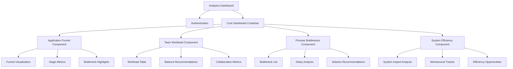
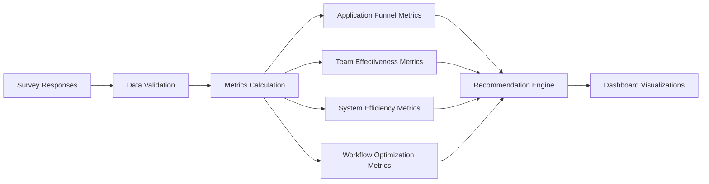

# Practical Admissions Analytics Dashboard: Real-World Implementation Plan

## Executive Summary

This plan transforms the current analytics dashboard into a practical, actionable tool specifically designed for admissions professionals. By focusing on metrics that directly impact daily operations and process improvement, we create a system that delivers immediate value while maintaining technical excellence.

Our approach is grounded in actual admissions workflows, using real-world metrics that staff will immediately understand and can act upon. The dashboard is designed to answer the critical question: **"How can we process applications more efficiently while maintaining quality?"**

## 1. Admissions-Specific Dashboard Focus

The refactored dashboard will focus on metrics that directly matter to admissions staff:

### 1.1 For Assessors (Application Reviewers)
- Current application queue status
- Application processing bottlenecks
- Document completion rates
- Team collaboration effectiveness

### 1.2 For Coordinators (Process Managers)
- Application funnel metrics
- Team workload distribution
- Process efficiency metrics
- System improvement opportunities

## 2. Core Metrics Mapped to Survey Data

Based on our survey data and admissions needs, these metrics provide actionable insights:

### 2.1 Application Funnel Metrics
- **Stage Conversion Rates**: Track where applicants drop off in the process
- **Incomplete Application Rate**: Percentage of applications missing key documents
- **Bottleneck Identification**: Specific stages causing delays (from Q161, Q258, Q310)

### 2.2 Team Effectiveness Metrics
- **Handoff Effectiveness**: How smoothly applications move between team members (from Q322, Q332)
- **Information Sharing Quality**: How well critical applicant information is communicated (from Q342, Q354)
- **Workload Distribution**: Balance of applications across team members

### 2.3 System Efficiency Metrics
- **Tool Impact Analysis**: How multiple systems affect processing speed (from Q218)
- **Manual Workaround Frequency**: Where staff create workarounds due to system limitations (from Q131, Q141, Q290)
- **Process Friction Points**: Specific activities that slow down application processing

### 2.4 Workflow Optimization Metrics
- **Administrative vs. Processing Time**: Time spent on paperwork vs. evaluation (from Q172, Q248)
- **System vs. Strategic Time**: Manager time spent troubleshooting vs. improving process (from Q57)
- **Quick Win Opportunities**: High-impact, low-effort improvement areas

## 3. Practical Dashboard Visualizations

Each visualization is designed to be immediately understood and actionable:

### 3.1 Application Funnel View

```
┌──────────────────────────────────────────────────────────────────────────┐
│ APPLICATION FUNNEL                                                       │
│                                                                          │
│ Inquiry → Application Started → Documents Complete → Under Review → Decision │
│  1,245        842 (68%)           573 (68%)          498 (87%)     470 (94%) │
│                                                                          │
│   PRIMARY BOTTLENECK: Document Completion Stage                          │
│   • 269 applications stuck at document completion                        │
│   • Most common missing document: Financial verification                 │
│   • Avg. time in stage: 12 days (↑3 days from last month)               │
└──────────────────────────────────────────────────────────────────────────┘
```

### 3.2 Team Workload & Collaboration View

```
┌──────────────────────────────────────────────────────────────────────────┐
│ TEAM WORKLOAD                        │ COLLABORATION QUALITY             │
│                                      │                                   │
│ Assessor      Current Queue   Status │ Handoff Effectiveness: 6.8/10     │
│ ───────────────────────────────────  │ Information Sharing: 7.1/10       │
│ Team A            32          ✓ On track │ Communication Quality: 7.5/10     │
│ Team B            47          ⚠ High     │                                   │
│ Team C            28          ✓ On track │ Top collaboration issue:          │
│ Team D            18          ✓ Low      │ Incomplete notes during handoffs  │
│                                      │                                   │
│ RECOMMEND: Redistribute 10           │ QUICK FIX: Implement standardized │
│ applications from Team B to Team D   │ handoff checklist template        │
└──────────────────────────────────────┴───────────────────────────────────┘
```

### 3.3 Process Bottlenecks View

```
┌──────────────────────────────────────────────────────────────────────────┐
│ PROCESS BOTTLENECKS                                                      │
│                                                                          │
│ Top 3 Processing Delays:                                                 │
│                                                                          │
│ 1. Financial document verification    │████████████████│ 12.4 days       │
│    Issue: Manual verification process across multiple systems            │
│    Solution: Create unified verification checklist                       │
│                                                                          │
│ 2. Academic credential evaluation     │████████│ 8.2 days                │
│    Issue: External evaluators have inconsistent turnaround times         │
│    Solution: Implement automated follow-up system                        │
│                                                                          │
│ 3. Letter of recommendation collection │██████│ 6.5 days                 │
│    Issue: Reminder system not automated                                  │
│    Solution: Set up automated email reminders                            │
└──────────────────────────────────────────────────────────────────────────┘
```

### 3.4 System Efficiency View

```
┌──────────────────────────────────────────────────────────────────────────┐
│ SYSTEM EFFICIENCY                                                        │
│                                                                          │
│ Multiple System Impact                 │ Manual Workarounds              │
│ ─────────────────────────────────────  │ ─────────────────────────────── │
│ Systems used: 6 (Benchmark: 3)         │ Total workarounds: 4            │
│ Login frequency: 8x daily              │ Most common: Excel tracking (72%)│
│ Data re-entry: 4x per application      │ Second: Email folders (65%)     │
│                                        │ Third: Calendar reminders (58%) │
│                                        │                                 │
│ OPPORTUNITY: Single sign-on would      │ OPPORTUNITY: Centralized        │
│ save ~15 minutes per day per assessor  │ tracking system would eliminate │
│                                        │ 80% of manual workarounds       │
└────────────────────────────────────────┴─────────────────────────────────┘
```

## 4. Technical Implementation Approach

### 4.1 Component Architecture



### 4.2 Data Processing Workflow



### 4.3 API Structure

The API will be refactored into focused endpoints:

1. `/api/analytics/application-funnel` - Stage conversion metrics
2. `/api/analytics/team-workload` - Team assignment and collaboration data
3. `/api/analytics/process-bottlenecks` - Delay analysis and recommendations
4. `/api/analytics/system-efficiency` - System impact and workaround analysis

## 5. Data Models Mapped to Survey Questions

Our survey provides specific data we can transform into actionable metrics:

### 5.1 Application Funnel Data

```typescript
interface ApplicationFunnelMetrics {
  // From Q161: "How often are prospects lost due to system limitations?"
  leadLossFrequency: string; // Qualitative response
  
  // From Q183: "Estimate what percentage of prospects are lost due to system delays"
  estimatedLossPercentage: string; // Percentage range
  
  // From Q270: "How confident are you that no prospect is lost in your pipeline?"
  pipelineConfidence: number; // 1-10 scale
  
  // From Q364: "At what stage do you lose most prospects?"
  primaryLossStage: {
    stage: string;
    percentage: number;
  }[];
  
  // Calculated bottlenecks from multiple responses
  bottlenecks: {
    stage: string;
    severity: number;
    description: string;
    recommendedAction: string;
  }[];
}
```

### 5.2 Team Effectiveness Data

```typescript
interface TeamEffectivenessMetrics {
  // From Q322: "How effectively can you share prospect information with colleagues?"
  informationSharingScore: number; // 1-10 scale
  
  // From Q332: "Rate the quality of handoffs between team members"
  handoffQualityScore: number; // 1-10 scale
  
  // From Q342: "What communication gaps exist between you and management?"
  communicationGaps: string[]; // Selected options
  
  // From Q354: "How often do you and your manager review your pipeline together?"
  pipelineReviewFrequency: string; // Selected option
  
  // Calculated collaboration metrics
  collaborationScore: number; // Composite score
  collaborationIssues: {
    issue: string;
    severity: number;
    recommendedAction: string;
  }[];
}
```

### 5.3 System Efficiency Data

```typescript
interface SystemEfficiencyMetrics {
  // From Q218: "How many different systems/tools do you use daily?"
  toolCount: string; // Selected range
  
  // From Q131: "How many manual workarounds has your team created?"
  workaroundCount: string; // Selected range
  
  // From Q141: "List the 3 most critical workarounds your team uses"
  criticalWorkarounds: string; // Text response
  
  // From Q290: "What manual tracking methods have you created outside the system?"
  manualTrackingMethods: string[]; // Selected options
  
  // From Q258: "How often must you log into multiple systems to complete a task?"
  multipleLoginFrequency: string; // Selected option
  
  // Calculated system impact metrics
  systemComplexityScore: number; // Composite score
  systemImprovements: {
    area: string;
    potentialTimeSaving: string;
    implementationEffort: string;
  }[];
}
```

### 5.4 Workflow Optimization Data

```typescript
interface WorkflowOptimizationMetrics {
  // From Q172: "What percentage of your team's time is spent on data entry vs. actual sales?"
  teamTimeAllocation: {
    dataEntry: number;
    sales: number;
    other: number;
  };
  
  // From Q248: "What percentage of your day is spent on administrative vs. sales tasks?"
  individualTimeAllocation: {
    administrative: number;
    sales: number;
    other: number;
  };
  
  // From Q57: "What percentage of your weekly time is spent on system problems vs. strategic planning?"
  managerTimeAllocation: {
    systemProblems: number;
    strategicPlanning: number;
    other: number;
  };
  
  // Calculated optimization opportunities
  timeOptimizationOpportunities: {
    area: string;
    currentTimeSpent: string;
    potentialImprovement: string;
    recommendedAction: string;
  }[];
}
```

## 6. Implementation Plan

### 6.1 Phase 1: Core Metrics (2 weeks)

1. Refactor the data processing pipeline
   - Create mapping functions for survey data
   - Implement metric calculation algorithms
   - Add data validation and confidence scoring

2. Develop API endpoints for each metric category
   - Create focused, performant endpoints
   - Implement proper error handling
   - Add authentication improvements

### 6.2 Phase 2: Dashboard Components (2 weeks)

1. Create core visualization components
   - Application funnel chart
   - Team workload table
   - Process bottleneck visualization
   - System efficiency dashboard

2. Implement practical recommendation engine
   - Generate actionable recommendations
   - Prioritize by implementation effort
   - Link directly to supporting data

### 6.3 Phase 3: Integration & User Experience (1 week)

1. Combine components into unified dashboard
   - Create consistent layout
   - Implement responsive design
   - Add interactive filtering

2. Add export and sharing capabilities
   - PDF reports
   - CSV data export
   - Team sharing tools

### 6.4 Phase 4: Testing & Refinement (1 week)

1. Conduct user testing with admissions staff
2. Refine based on practical feedback
3. Document the system for future maintenance
4. Create training materials for staff

## 7. File Structure

```
/src
  /app
    /analytics
      /page.tsx                          # Main container
      /components
        /application-funnel
          /ApplicationFunnel.tsx         # Funnel visualization
          /StageMetrics.tsx              # Stage-specific metrics
          /BottleneckHighlight.tsx       # Bottleneck indicators
        /team-workload
          /WorkloadTable.tsx             # Team assignment table
          /WorkloadBalance.tsx           # Balance recommendations
          /CollaborationMetrics.tsx      # Team collaboration stats
        /process-bottlenecks
          /BottleneckList.tsx            # Bottleneck display
          /DelayAnalysis.tsx             # Processing delay metrics
          /SolutionCard.tsx              # Solution recommendations
        /system-efficiency
          /SystemImpact.tsx              # System impact analysis
          /WorkaroundTracker.tsx         # Workaround tracking
          /EfficiencyOpportunities.tsx   # Opportunity highlights
        /shared
          /MetricCard.tsx                # Reusable metric display
          /RecommendationBox.tsx         # Recommendation component
          /ConfidenceIndicator.tsx       # Data confidence display
  /lib
    /analytics
      /processors
        /applicationFunnel.ts            # Funnel metrics calculation
        /teamEffectiveness.ts            # Team metrics calculation
        /systemEfficiency.ts             # System metrics calculation
        /workflowOptimization.ts         # Workflow metrics calculation
      /recommendations
        /bottleneckSolutions.ts          # Bottleneck recommendations
        /workloadBalancing.ts            # Team balance recommendations
        /efficiencyImprovements.ts       # Efficiency recommendations
      /utils
        /confidenceCalculation.ts        # Confidence scoring
        /dataValidation.ts               # Data validation
        /metricMapping.ts                # Survey data mapping
      /types.ts                          # Type definitions
  /api
    /analytics
      /application-funnel
        /route.ts                        # Funnel metrics API
      /team-workload
        /route.ts                        # Team workload API
      /process-bottlenecks
        /route.ts                        # Process bottlenecks API
      /system-efficiency
        /route.ts                        # System efficiency API
```

## 8. Handling Limited Historical Data

Since we currently have only one data collection point, we'll:

1. **Clearly Mark Baselines**: Indicate that metrics are baselines for future comparison
2. **Use Internal Benchmarks**: Compare teams and processes against each other
3. **Industry References**: Include industry standards where available
4. **Confidence Indicators**: Show data confidence based on sample size
5. **Focus on Current State**: Emphasize actionable insights from current data

```jsx
// Example of baseline indicator component
<BaselineIndicator
  metric="Application Conversion Rate"
  value={data.conversionRate}
  collectionDate={data.collectionDate}
  sampleSize={data.responses.length}
  confidence={calculateConfidence(data.responses.length)}
  note="This is your baseline measurement. Future surveys will show trends."
/>
```

## 9. Dashboard Preview: Focus on Real-World Application

```
┌──────────────────────────────────────────────────────────────────────────┐
│ ADMISSIONS ANALYTICS DASHBOARD                         ⟳ Refresh  ⤓ Export │
├──────────────────────────────────────────────────────────────────────────┤
│                                                                          │
│ CURRENT SNAPSHOT: 842 Active Applications | 573 Complete | 498 In Review │
│                                                                          │
├──────────────────────────────────────────────────────────────────────────┤
│ APPLICATION FUNNEL                                                       │
│                                                                          │
│ Inquiry → Application Started → Documents Complete → Under Review → Decision │
│  1,245        842 (68%)           573 (68%)          498 (87%)     470 (94%) │
│                                                                          │
│   PRIMARY BOTTLENECK: Document Completion Stage                          │
│   • 269 applications stuck at document completion                        │
│   • Most common missing document: Financial verification                 │
│   • Avg. time in stage: 12 days (baseline)                              │
└──────────────────────────────────────────────────────────────────────────┘
│                                                                          │
├──────────────────────────────────────────────────────────────────────────┤
│ TEAM WORKLOAD                        │ COLLABORATION QUALITY             │
│                                      │                                   │
│ Assessor      Current Queue   Status │ Handoff Effectiveness: 6.8/10     │
│ ───────────────────────────────────  │ Information Sharing: 7.1/10       │
│ Team A            32          ✓ On track │ Communication Quality: 7.5/10     │
│ Team B            47          ⚠ High     │                                   │
│ Team C            28          ✓ On track │ Top collaboration issue:          │
│ Team D            18          ✓ Low      │ Incomplete notes during handoffs  │
│                                      │                                   │
│ RECOMMEND: Redistribute 10           │ QUICK FIX: Implement standardized │
│ applications from Team B to Team D   │ handoff checklist template        │
└──────────────────────────────────────┴───────────────────────────────────┘
│                                                                          │
├──────────────────────────────────────────────────────────────────────────┤
│ TOP 3 IMPROVEMENT OPPORTUNITIES                                          │
│                                                                          │
│ 1. STANDARDIZE DOCUMENT COLLECTION                                       │
│    • Current impact: 269 stalled applications                            │
│    • Solution: Create unified document checklist and automated reminders │
│    • Expected result: 40% reduction in document completion time          │
│                                                                          │
│ 2. IMPLEMENT STANDARDIZED HANDOFF PROCESS                                │
│    • Current impact: Inconsistent information transfer                   │
│    • Solution: Create digital handoff template with required fields      │
│    • Expected result: 25% reduction in follow-up questions               │
│                                                                          │
│ 3. REDUCE SYSTEM SWITCHING                                               │
│    • Current impact: 8 separate logins per day per assessor              │
│    • Solution: Implement single sign-on for core systems                 │
│    • Expected result: ~15 minutes saved per assessor per day             │
└──────────────────────────────────────────────────────────────────────────┘
```

## 10. Conclusion: A Practical, Real-World Solution

This analytics refactoring plan:

1. **Focuses on Real Admissions Processes**: Uses metrics that directly reflect admissions workflows
2. **Delivers Practical Insights**: Provides actionable recommendations for immediate improvements
3. **Speaks the Right Language**: Uses terminology and concepts familiar to admissions professionals
4. **Balances Detail and Clarity**: Provides enough detail to be useful without overwhelming users
5. **Makes Data Limitations Clear**: Honestly represents confidence levels and baseline nature of metrics

By implementing this plan, we'll create an analytics dashboard that admissions staff will actually use daily to improve their processes and efficiency, rather than an abstract collection of metrics that don't connect to their daily work.