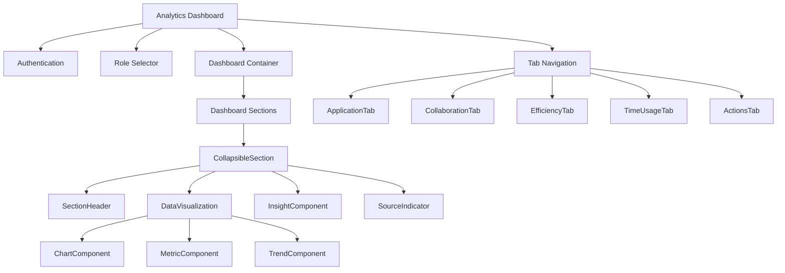
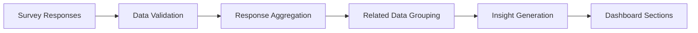

# Analytics Refactoring Plan 5: Transparent, Practical Admissions Analytics

## Executive Summary

This final plan synthesizes the best elements from all previous plans while addressing key feedback. Plan 5 creates a transparent, practical analytics system that clearly shows which survey questions inform each visualization, focuses on actual admissions workflows, and delivers actionable insights without unnecessary complexity.

Key improvements include:
1. **Source-Transparent Components**: Every visualization clearly shows which questions it's based on
2. **Direct Question Visualization**: Simple, clear representations of specific survey responses
3. **Role-Appropriate Views**: Tailored displays for assessors vs. coordinators
4. **Strong Technical Architecture**: Clean component separation with validated data sources
5. **Workflow-Oriented Organization**: Organized around actual admissions processes

## 1. Key Principles

This refactoring plan is guided by five core principles:

1. **Complete Transparency**: Every metric must clearly show its data source and confidence level
2. **Practical Actionability**: Insights must connect directly to specific process improvements
3. **Workflow Relevance**: Components must align with actual admissions tasks and responsibilities
4. **Visual Clarity**: Visualizations must be immediately understandable without training
5. **Technical Excellence**: Clean architecture with proper separation of concerns

## 2. Dashboard Structure and Organization

The dashboard will be organized into four key areas that directly reflect the admissions process:

1. **Application Processing**: How applications move through the system
2. **Team Collaboration**: How effectively team members work together
3. **System Efficiency**: How well current tools support the process
4. **Process Improvement**: Specific opportunities to enhance the process

Each area will include:
- Clear indication of source questions
- Simple visualizations of survey responses
- Practical insights and recommendations
- Confidence indicators based on response count

## 3. Integrated Dashboard Approach with Collapsible Sections

The dashboard will use a more integrated approach with collapsible sections and tabs for better organization:

```
┌─────────────────────────────────────────────────────────────────┐
│ DASHBOARD TABS:  [Application] [Collaboration] [Efficiency]     │
└─────────────────────────────────────────────────────────────────┘

┌─────────────────────────────────────────────────────────────────┐
│ ▼ LEAD LOSS ANALYSIS                                           │
│   Source: Questions #161, #364 | 28 Responses                   │
├─────────────────────────────────────────────────────────────────┤
│                                                                 │
│ [Visualization of multiple related metrics in one view]         │
│                                                                 │
│ INSIGHT: 75% of respondents report losing prospects, with       │
│ document collection (42%) being the primary bottleneck          │
│                                                                 │
│ ► View Question Details                                         │
└─────────────────────────────────────────────────────────────────┘
```

This structure offers several advantages:
1. Question sources are indicated without cluttering the interface
2. Related metrics are grouped together for better context
3. Users can expand sections to see more details if needed
4. The interface remains clean while maintaining transparency

## 4. Core Dashboard Components

### 4.1 Application Processing Dashboard

```
┌──────────────────────────────────────────────────────────────────┐
│ ▼ LEAD LOSS ANALYSIS                                             │
│   Source: Questions #161, #364 | 28 Responses                    │
├──────────────────────────────────────────────────────────────────┤
│                                                                  │
│ FREQUENCY OF LEAD LOSS:                                          │
│ Never/Rarely:    25% ■■□□□□□□□□                                  │
│ Sometimes:       36% ■■■■□□□□□□                                  │
│ Frequently/Always: 39% ■■■■□□□□□□                                │
│                                                                  │
│ WHERE LEADS ARE LOST:                                            │
│ Initial Inquiry:      15% ■■□□□□□□□□                             │
│ Application Started:  22% ■■□□□□□□□□                             │
│ Document Collection:  42% ■■■■□□□□□□                             │
│ Application Review:   12% ■□□□□□□□□□                             │
│ Final Decision:        9% ■□□□□□□□□□                             │
│                                                                  │
│ INSIGHT: Document collection represents the most significant     │
│ bottleneck, with 75% of staff reporting lead losses              │
└──────────────────────────────────────────────────────────────────┘

┌──────────────────────────────────────────────────────────────────┐
│ ▼ PIPELINE CONFIDENCE                                            │
│   Source: Question #270 | 28 Responses                           │
├──────────────────────────────────────────────────────────────────┤
│                                                                  │
│ Average Confidence: 5.8/10                                       │
│                                                                  │
│ Low Confidence (1-3):    21% ■■□□□□□□□□                          │
│ Medium Confidence (4-7):  54% ■■■■■□□□□□                         │
│ High Confidence (8-10):   25% ■■□□□□□□□□                         │
│                                                                  │
│ INSIGHT: Only 25% of staff report high confidence in pipeline    │
│ tracking, suggesting significant improvement opportunities       │
└──────────────────────────────────────────────────────────────────┘
```

### 4.2 Team Collaboration Dashboard

```
┌──────────────────────────────────────────────────────────────────┐
│ ▼ TEAM COMMUNICATION EFFECTIVENESS                               │
│   Source: Questions #322, #332 | 28 Responses                    │
├──────────────────────────────────────────────────────────────────┤
│                                                                  │
│ INFORMATION SHARING:                                             │
│ Average Score: 6.2/10                                            │
│                                                                  │
│ HANDOFF QUALITY:                                                 │
│ Average Score: 5.8/10                                            │
│                                                                  │
│ TEAM EFFECTIVENESS RATINGS:                                      │
│ Low (1-3):       16% ■■□□□□□□□□                                  │
│ Medium (4-7):    63% ■■■■■■□□□□                                  │
│ High (8-10):     21% ■■□□□□□□□□                                  │
│                                                                  │
│ INSIGHT: Only 21% of staff report high effectiveness in team     │
│ communication, indicating significant room for improvement       │
└──────────────────────────────────────────────────────────────────┘

┌──────────────────────────────────────────────────────────────────┐
│ ▼ COMMUNICATION CHALLENGES                                       │
│   Source: Question #342 | 28 Responses                           │
├──────────────────────────────────────────────────────────────────┤
│                                                                  │
│ TOP CHALLENGES:                                                  │
│ Unclear expectations:    68% ■■■■■■■□□□                          │
│ Conflicting priorities:  57% ■■■■■■□□□□                          │
│ Limited feedback:        54% ■■■■■□□□□□                          │
│                                                                  │
│ OTHER ISSUES:                                                    │
│ Inaccurate metrics:      46% ■■■■■□□□□□                          │
│ Lack of recognition:     39% ■■■■□□□□□□                          │
│ Delayed training:        32% ■■■□□□□□□□                          │
│                                                                  │
│ INSIGHT: Unclear expectations and conflicting priorities         │
│ represent the most significant communication challenges          │
└──────────────────────────────────────────────────────────────────┘

┌──────────────────────────────────────────────────────────────────┐
│ ▼ PIPELINE REVIEW FREQUENCY                                      │
│   Source: Question #354 | 28 Responses                           │
├──────────────────────────────────────────────────────────────────┤
│                                                                  │
│ Weekly or more:    39% ■■■■□□□□□□                                │
│ Biweekly:          18% ■■□□□□□□□□                                │
│ Monthly or less:   43% ■■■■□□□□□□                                │
│                                                                  │
│ INSIGHT: 43% of staff review pipelines monthly or less           │
│ frequently, suggesting a need for more regular reviews           │
└──────────────────────────────────────────────────────────────────┘
```

### 4.3 System Efficiency Dashboard

```
┌──────────────────────────────────────────────────────────────────┐
│ ▼ SYSTEM COMPLEXITY                                              │
│   Source: Questions #218, #258 | 28 Responses                    │
├──────────────────────────────────────────────────────────────────┤
│                                                                  │
│ DAILY TOOL COUNT:                                                │
│ 1-4 systems:   29% ■■■□□□□□□□                                    │
│ 5+ systems:    72% ■■■■■■■□□□                                    │
│                                                                  │
│ MULTIPLE LOGINS REQUIRED:                                        │
│ Rarely/Sometimes: 36% ■■■■□□□□□□                                 │
│ Frequently/Always: 64% ■■■■■■□□□□                                │
│                                                                  │
│ INSIGHT: 72% of staff use 5+ separate systems daily, with 64%    │
│ frequently needing multiple logins for a single task             │
└──────────────────────────────────────────────────────────────────┘

┌──────────────────────────────────────────────────────────────────┐
│ ▼ SYSTEM WORKAROUNDS                                             │
│   Source: Questions #131, #290 | 28 Responses                    │
├──────────────────────────────────────────────────────────────────┤
│                                                                  │
│ WORKAROUND COUNT:                                                │
│ 0-3 workarounds: 36% ■■■■□□□□□□                                  │
│ 4+ workarounds:  64% ■■■■■■□□□□                                  │
│                                                                  │
│ TOP MANUAL TRACKING METHODS:                                     │
│ Excel spreadsheets:   75% ■■■■■■■□□□                             │
│ Email folders:        71% ■■■■■■■□□□                             │
│ Personal calendar:    64% ■■■■■■□□□□                             │
│ Sticky notes:         57% ■■■■■■□□□□                             │
│                                                                  │
│ INSIGHT: 64% of staff use 4+ workarounds, with spreadsheets      │
│ and email folders being the most common manual systems           │
└──────────────────────────────────────────────────────────────────┘
```

### 4.4 Time Allocation Dashboard

```
┌──────────────────────────────────────────────────────────────────┐
│ ▼ TIME USAGE ANALYSIS                                            │
│   Source: Questions #172, #248, #57 | 28 Responses               │
├──────────────────────────────────────────────────────────────────┤
│                                                                  │
│ STAFF TIME USAGE:                                                │
│ Administrative/Data Entry: 45% ■■■■■□□□□□                        │
│ Sales/Core Activities:     35% ■■■□□□□□□□                        │
│ Other Activities:          20% ■■□□□□□□□□                        │
│                                                                  │
│ MANAGER TIME USAGE:                                              │
│ System Problems:     42% ■■■■□□□□□□                              │
│ Strategic Planning:  12% ■□□□□□□□□□                              │
│ Other Activities:    46% ■■■■■□□□□□                              │
│                                                                  │
│ INSIGHT: Staff spend more time on administrative tasks than      │
│ core activities, while managers spend 3.5x more time on          │
│ system problems than strategic planning                          │
└──────────────────────────────────────────────────────────────────┘
```

## 5. Process Improvement Recommendations Dashboard

The recommendations dashboard maintains the insight connections while presenting them in a more actionable format:

```
┌──────────────────────────────────────────────────────────────────┐
│ ▼ TOP IMPROVEMENT OPPORTUNITIES                                  │
│   Based on Survey Analysis | Updated: June 2025                  │
├──────────────────────────────────────────────────────────────────┤
│                                                                  │
│ 1. DOCUMENT COLLECTION PROCESS                                   │
│    • Issue: 42% of prospects lost during document collection     │
│    • Solution: Create standardized document checklist with       │
│      automated reminders                                         │
│    • Expected Impact: Higher application completion rate         │
│                                                                  │
│ 2. SYSTEM INTEGRATION                                            │
│    • Issue: 64% need multiple logins for single tasks            │
│    • Solution: Implement single sign-on and unified dashboard    │
│    • Expected Impact: 45% reduction in administrative time       │
│                                                                  │
│ 3. STANDARDIZED HANDOFFS                                         │
│    • Issue: Only 18% report high-quality handoffs                │
│    • Solution: Create digital handoff templates                  │
│    • Expected Impact: Improved information transfer              │
│                                                                  │
│ ► View All Recommendations                                       │
└──────────────────────────────────────────────────────────────────┘
```

## 6. Role-Based Views and Navigation

The dashboard will use a tab-based navigation system with role-specific views:

```
┌───────────────────────────────────────────────────────────────────┐
│ DASHBOARD TABS:                                                   │
│ [Application] [Collaboration] [Efficiency] [Time Usage] [Actions] │
└───────────────────────────────────────────────────────────────────┘

┌───────────────────────────────────────────────────────────────────┐
│ View As:  [✓] Assessor  [ ] Coordinator                           │
└───────────────────────────────────────────────────────────────────┘
```

Each role will see tailored content with different priorities:

### 6.1 Assessor View Features
- Process bottlenecks in their specific workflow
- Personal time allocation analysis
- System efficiency issues affecting daily work
- Recommended actions for their role

### 6.2 Coordinator View Features
- Team-wide performance metrics
- Process efficiency across all stages
- Resource allocation opportunities
- System improvement priorities for the organization

All metrics will be collapsible to allow users to focus on what matters most to them, with "Quick View" and "Detailed View" options.

## 7. Technical Implementation

### 7.1 Component Architecture



### 7.2 Reusable Components

The architecture will use a simplified component structure:

```typescript
// Collapsible dashboard section
interface CollapsibleSectionProps {
  title: string;              // Section title
  sourceQuestions: number[];  // Question IDs used as sources
  responseCount: number;      // Number of responses
  defaultExpanded?: boolean;  // Whether expanded by default
  children: React.ReactNode;  // Section content
  insight: string;            // Actionable insight
  detailsAvailable?: boolean; // Whether detailed view is available
}

// Data visualization component
interface DataVisualizationProps {
  type: 'bar' | 'pie' | 'line' | 'metric' | 'distribution';
  data: any;                  // Visualization data
  compact?: boolean;          // Whether to show compact view
}

// Source indicator component
interface SourceIndicatorProps {
  questions: number[];        // Question IDs
  responseCount: number;      // Number of responses
  lastUpdated: Date;          // Last data update
  showDetails?: boolean;      // Whether to show question details
}
```

### 7.3 Data Processing Pipeline



### 7.4 API Structure

```
/api/analytics/
  /dashboards/:type          - Data for specific dashboard type
  /sections/:id              - Data for specific dashboard section
  /insights                  - Generated insights and recommendations
  /role/:role                - Role-specific dashboard configuration
```

## 8. File Structure

```
/src
  /app
    /analytics
      /page.tsx               # Main container with tab navigation
      /components
        /section              # Section components
          /CollapsibleSection.tsx  # Collapsible section component
          /SectionHeader.tsx  # Section header component
          /SourceIndicator.tsx # Source information component
          /InsightBox.tsx     # Insight display component
        /visualization        # Data visualization components
          /BarChart.tsx       # Bar chart component
          /DistributionChart.tsx # Distribution chart
          /MetricDisplay.tsx  # Single metric display
          /ComparisonChart.tsx # Data comparison component
        /navigation
          /TabNavigation.tsx  # Tab navigation component
          /RoleSelector.tsx   # Role selection component
        /dashboards           # Dashboard tab components
          /ApplicationDashboard.tsx
          /CollaborationDashboard.tsx
          /EfficiencyDashboard.tsx
          /TimeUsageDashboard.tsx
          /ActionsDashboard.tsx
  /lib
    /analytics
      /processors             # Data processing functions
        /aggregation.ts       # Response aggregation
        /grouping.ts          # Related data grouping
        /insights.ts          # Insight generation
      /config                 # Dashboard configuration
        /sections.ts          # Section definitions
        /questions.ts         # Question mappings
        /roles.ts             # Role-specific configurations
      /hooks                  # Custom React hooks
        /useDashboardData.ts  # Data fetching hook
        /useRoleContext.ts    # Role context hook
  /api
    /analytics
      /dashboards
        /[type]/route.ts      # Dashboard data endpoints
      /sections
        /[id]/route.ts        # Section data endpoints
      /insights
        /route.ts             # Insights endpoint
      /role
        /[role]/route.ts      # Role configuration endpoint
```

## 9. Implementation Plan

### 9.1 Phase 1: Core Framework and Navigation (1 week)

1. Create dashboard shell with tab navigation
   - Tab navigation component
   - Role selector
   - Section container layout
   - Collapsible section component

2. Implement data processing foundation
   - Response aggregation
   - Data grouping for related metrics
   - Basic chart components

### 9.2 Phase 2: Dashboard Sections (2 weeks)

1. Create main dashboard sections
   - Application processing sections
   - Team collaboration sections
   - System efficiency sections
   - Time usage sections
   - Action recommendation sections

2. Implement insight generation
   - Automatic insight detection
   - Recommendation prioritization
   - Confidence level indicators

### 9.3 Phase 3: Interactive Features (1 week)

1. Implement interactive elements
   - Expandable sections
   - Detail views
   - Hover explanations
   - Source information displays

2. Build role-specific views
   - Role-based filtering
   - Priority ordering by role
   - Relevant section highlighting

### 9.4 Phase 4: Refinement and User Experience (2 weeks)

1. User experience improvements
   - Performance optimization
   - Animation and transitions
   - Responsive design adjustments
   - Accessibility enhancements

2. Testing and refinement
   - Usability testing with assessors and coordinators
   - Performance benchmarking
   - Visual design polishing

## 10. Conclusion: Focused Clarity and User Experience

This refined plan creates an analytics dashboard that:

1. **Prioritizes User Experience**: Clean, focused interface with collapsible sections
2. **Maintains Transparency**: Source indicators without overwhelming detail
3. **Groups Related Metrics**: Logical organization of related data points
4. **Provides Role Relevance**: Tailored views for different stakeholders
5. **Emphasizes Insights Over Data**: Focus on what the data means, not just the raw numbers

By implementing this plan, we'll create a dashboard that balances transparency with usability, providing clear insights without overwhelming users with raw question data. The collapsible sections and tab navigation allow users to focus on what matters most to them, while still maintaining a clear connection to the underlying survey data.