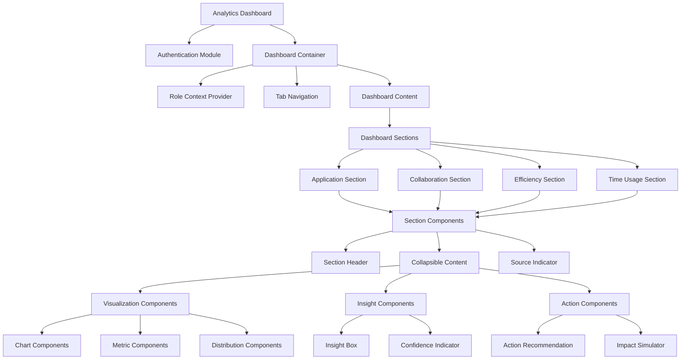
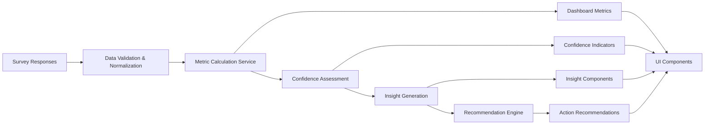

# Analytics Refactoring Plan 6: Optimal Synthesis for Admissions Analytics

## Executive Summary

After comprehensive analysis of all five previous refactoring plans and the current implementation, this definitive plan synthesizes the most effective elements from each approach while addressing their limitations. Plan 6 creates a technically excellent, user-focused analytics dashboard that delivers actionable insights for the admissions process.

The plan prioritizes:

1. **Technical Excellence**: Clean architecture with proper separation of concerns
2. **Data Honesty**: Transparency about data sources and confidence levels
3. **Workflow Relevance**: Organization around actual admissions processes
4. **Role-Appropriate Views**: Tailored displays for different stakeholders
5. **Actionable Insights**: Clear path from metrics to decisions

This synthesis approach combines Plan 5's transparent architecture, Plan 2's data reality assessment, Plan 3's decision support framework, and Plan 4's practical visualizations to create a truly optimal solution.

## 1. Current State Analysis

### 1.1 Technical Issues

The current analytics implementation suffers from several critical issues:

- **Monolithic Components**: Frontend (1200+ lines) and API route (1398 lines) are excessively large
- **Mixed Concerns**: UI rendering, data processing, and business logic are intertwined
- **Redundant Calculations**: Similar transformations performed in multiple places
- **Poor Error Handling**: Minimal validation or error recovery mechanisms
- **Authentication Vulnerability**: Hardcoded password ("uniat") in frontend code
- **Missing Type Definitions**: Incomplete interfaces and type safety

### 1.2 Data & Analytics Issues

Beyond technical debt, the analytics system has fundamental usability problems:

- **Metric Overload**: Too many metrics without clear hierarchy or significance
- **Weak Data Connection**: Limited transparency about which survey questions inform metrics
- **Unclear Confidence Levels**: No indication of data reliability based on sample size
- **Mixed Stakeholder Needs**: No role-specific views for different users
- **Limited Actionability**: Metrics don't clearly connect to specific process improvements
- **Visual Inconsistency**: Lack of unified design patterns for visualizations

### 1.3 Data Reality Assessment

Based on thorough analysis of `src/lib/questions.ts` and `src/app/api/analytics/route.ts`, our survey data has specific strengths and limitations:

**Strong Data Areas:**
- Time allocation metrics (questions 57, 172, 248)
- System complexity measurements (questions 131, 141, 218, 290)
- Team collaboration (questions 322, 332, 342, 354)
- Personal productivity barriers (questions 407, 426)

**Limited Data Areas:**
- Lead funnel stage-by-stage conversion rates
- Detailed time-in-stage measurements
- Objective performance metrics
- ROI calculations for system improvements

## 2. Guiding Principles

Six core principles will guide this refactoring:

1. **Transparency First**: Every metric must clearly indicate its data source and confidence level
2. **Workflow Alignment**: Dashboard organization must reflect actual admissions processes
3. **Role-Appropriate Insights**: Different stakeholders need different views of the same data
4. **Progressive Disclosure**: Information should be revealed in layers of increasing detail
5. **Technical Excellence**: Clean architecture with proper separation of concerns
6. **Data-Validated Metrics**: Only show metrics that have sufficient survey data support

## 3. System Architecture

### 3.1 Component Architecture



### 3.2 Data Flow Architecture



### 3.3 Service-Based Architecture

The refactored system will use specialized services to handle different aspects of the analytics processing:

```typescript
// Core services structure
interface AnalyticsServices {
  // Data acquisition and processing
  dataService: {
    fetchSurveyData(): Promise<SurveyResponse[]>;
    validateResponses(responses: SurveyResponse[]): ValidatedResponses;
    groupByQuestion(responses: ValidatedResponses): QuestionGroups;
  };
  
  // Metric calculation
  metricService: {
    calculateTimeMetrics(responses: ValidatedResponses): TimeMetrics;
    calculateCollaborationMetrics(responses: ValidatedResponses): CollaborationMetrics;
    calculateSystemMetrics(responses: ValidatedResponses): SystemMetrics;
    calculateProcessMetrics(responses: ValidatedResponses): ProcessMetrics;
  };
  
  // Insight generation
  insightService: {
    generateTimeInsights(metrics: TimeMetrics): TimeInsights;
    generateCollaborationInsights(metrics: CollaborationMetrics): CollaborationInsights;
    generateSystemInsights(metrics: SystemMetrics): SystemInsights;
    generateProcessInsights(metrics: ProcessMetrics): ProcessInsights;
  };
  
  // Recommendation engine
  recommendationService: {
    prioritizeRecommendations(insights: AllInsights): PrioritizedRecommendations;
    generateActionSteps(recommendation: Recommendation): ActionSteps;
    estimateImpact(recommendation: Recommendation): ImpactEstimate;
  };
  
  // Confidence assessment
  confidenceService: {
    calculateConfidence(responses: ValidatedResponses, questionIds: number[]): ConfidenceScore;
    getConfidenceLevel(score: ConfidenceScore): ConfidenceLevel;
    getConfidenceFactors(score: ConfidenceScore): ConfidenceFactors;
  };
}
```

## 4. Data Model & Metrics

### 4.1 Core Data Models

The system will use clearly defined data models with TypeScript interfaces:

```typescript
// Source-tracked metric with confidence
interface MetricWithSource<T> {
  value: T;
  sourceQuestions: number[];
  responseCount: number;
  confidence: {
    score: number; // 0-1 scale
    level: 'low' | 'medium' | 'high';
    factors: string[];
  };
  trend?: {
    direction: 'improving' | 'stable' | 'declining';
    change: number;
    period: string;
  };
}

// Dashboard section model
interface DashboardSection {
  id: string;
  title: string;
  metrics: MetricWithSource<any>[];
  insights: Insight[];
  recommendations: Recommendation[];
  isExpandable: boolean;
  defaultExpanded: boolean;
  roleVisibility: {
    assessor: boolean;
    coordinator: boolean;
    manager: boolean;
  };
}

// Insight model
interface Insight {
  id: string;
  title: string;
  description: string;
  severity: 'info' | 'warning' | 'critical' | 'positive';
  sourceMetrics: string[];
  confidence: number;
}

// Recommendation model
interface Recommendation {
  id: string;
  title: string;
  description: string;
  steps: string[];
  impact: {
    area: string;
    magnitude: 'low' | 'medium' | 'high';
    description: string;
  };
  effort: {
    level: 'quick-win' | 'medium' | 'significant';
    description: string;
    timeEstimate: string;
  };
  priority: number; // 1-10 scale
  sourceInsights: string[];
}
```

### 4.2 Key Metrics Mapped to Survey Data

Based on data reality assessment, these fully-supported metrics will be implemented:

#### 4.2.1 Time Allocation Metrics

| Metric | Data Source | Calculation | Confidence | Business Value |
|--------|-------------|-------------|------------|----------------|
| Admin/Sales Time Ratio | Q172, Q248 | Weighted average of reported time allocations | High | Identifies time optimization opportunities |
| Strategic vs. System Time | Q57 | Direct from manager responses | Medium | Shows management focus allocation |
| Time Efficiency Score | Derived | Function of admin/sales ratio | Medium | Overall efficiency indicator |

#### 4.2.2 System Complexity Metrics

| Metric | Data Source | Calculation | Confidence | Business Value |
|--------|-------------|-------------|------------|----------------|
| Tool Count | Q218 | Weighted average of reported tools | High | System simplification indicator |
| Login Fragmentation | Q258 | Frequency of multiple system logins | High | Process friction measure |
| Workaround Prevalence | Q131, Q290 | Combined from multiple responses | High | Shows system limitation impact |
| Critical Workarounds | Q141 | Text analysis of responses | Medium | Identifies urgent fixes |

#### 4.2.3 Team Collaboration Metrics

| Metric | Data Source | Calculation | Confidence | Business Value |
|--------|-------------|-------------|------------|----------------|
| Information Sharing Quality | Q322 | Direct from responses | High | Team collaboration indicator |
| Handoff Effectiveness | Q332 | Direct from responses | High | Process continuity measure |
| Communication Gap | Q342, Q354 | Combined from responses | High | Team alignment indicator |
| Pipeline Review Frequency | Q354 | Direct from responses | High | Management engagement measure |

#### 4.2.4 Process Bottleneck Metrics

| Metric | Data Source | Calculation | Confidence | Business Value |
|--------|-------------|-------------|------------|----------------|
| Lead Loss Frequency | Q161 | Direct from responses | High | Pipeline leakage indicator |
| Primary Loss Stage | Q364 | Stage with highest loss percentage | Medium | Bottleneck identifier |
| Lead Tracking Confidence | Q270 | Direct from responses | High | Process reliability measure |
| Data Access Time | Q310 | Direct from responses | High | Process friction measure |

### 4.3 Advanced Metric Calculations

For derived metrics that combine multiple data sources, we'll implement advanced calculations:

```typescript
// Example: Time efficiency calculation
function calculateTimeEfficiencyScore(
  adminTime: number,
  salesTime: number,
  strategicTime: number
): MetricWithSource<number> {
  // Calculate raw efficiency score (higher sales time = higher efficiency)
  const rawScore = salesTime / (adminTime + salesTime);
  
  // Adjust based on strategic time for managers
  const adjustedScore = strategicTime > 0 
    ? rawScore * (1 + (strategicTime / 100))
    : rawScore;
  
  // Scale to 0-10 range
  const scaledScore = Math.min(10, adjustedScore * 10);
  
  // Calculate confidence based on sample sizes
  const responseCount = getResponseCount([172, 248, 57]);
  const confidence = calculateConfidence(responseCount);
  
  return {
    value: scaledScore,
    sourceQuestions: [172, 248, 57],
    responseCount,
    confidence,
    trend: calculateTrend('timeEfficiency', scaledScore)
  };
}
```

## 5. UI/UX Design

### 5.1 Dashboard Organization

The dashboard will be organized into four main tabs with role-specific content:

1. **Application Process**: Metrics related to application flow and bottlenecks
2. **Team Collaboration**: Metrics related to team communication and handoffs
3. **System Efficiency**: Metrics related to tools, workarounds, and processes
4. **Improvement Actions**: Prioritized recommendations and impact analysis

Each tab will contain collapsible sections with source-transparent components.

### 5.2 Progressive Disclosure Design

Information will be revealed in layers of progressive detail:

1. **Summary View**: Key metrics and critical insights
2. **Expanded View**: Detailed breakdowns and visualizations
3. **Detailed View**: Complete data with source information

```
┌─────────────────────────────────────────────────────────────────┐
│ DASHBOARD TABS:  [Application] [Collaboration] [Efficiency] [Actions]
└─────────────────────────────────────────────────────────────────┘

┌─────────────────────────────────────────────────────────────────┐
│ ▼ LEAD LOSS ANALYSIS                                           │
│   Sources: Q161, Q364 | Responses: 28 | Confidence: Medium     │
├─────────────────────────────────────────────────────────────────┤
│                                                                 │
│ [Visualization of stage-by-stage loss percentages]              │
│                                                                 │
│ PRIMARY BOTTLENECK:                                             │
│ Document Collection Stage (42% of losses)                       │
│                                                                 │
│ INSIGHT: Document collection represents the most significant    │
│ bottleneck in the application process, with 42% of all losses   │
│ occurring at this stage.                                        │
│                                                                 │
│ RECOMMENDATION: Implement standardized document checklist       │
│ with automated reminders.                                       │
│                                                                 │
│ ► View Detailed Breakdown                                       │
└─────────────────────────────────────────────────────────────────┘
```

### 5.3 Role-Specific Views

Different user roles will see tailored content:

#### Assessor View
- Process bottlenecks in their specific workflow
- Personal time allocation analysis
- System efficiency issues affecting daily work
- Recommended actions for their role

#### Coordinator View
- Team-wide performance metrics
- Process efficiency across all stages
- Resource allocation opportunities
- System improvement priorities

#### Executive View
- High-level KPIs and trends
- Critical bottlenecks affecting outcomes
- Strategic improvement opportunities
- ROI estimates for system enhancements

### 5.4 Source-Transparent Components

Each visualization will clearly indicate its data source:

```jsx
<MetricCard
  title="Administrative Time"
  value={`${timeMetrics.adminTime.value.toFixed(0)}%`}
  sourceQuestions={timeMetrics.adminTime.sourceQuestions}
  responseCount={timeMetrics.adminTime.responseCount}
  confidence={timeMetrics.adminTime.confidence}
  insight="Staff spend nearly half their time on administrative tasks rather than core activities"
  recommendation={{
    title: "Reduce administrative burden",
    description: "Implementing automation for repetitive tasks could save significant time",
    impact: "high"
  }}
  trend={{
    direction: "stable",
    period: "3 months"
  }}
/>
```

### 5.5 Enhanced Visualizations

Key visualizations will focus on actionable insights:

#### Application Funnel Visualization
```
┌──────────────────────────────────────────────────────────────────┐
│ APPLICATION STAGES                                               │
│                                                                  │
│ Initial      Application   Document     Review      Decision     │
│ Inquiry  →   Started    →  Collection →  Process  →  Stage       │
│  1,245        842          573          498         470         │
│   100%        68%          68%          87%         94%         │
│                                                                  │
│ BOTTLENECK INDICATORS:                                           │
│ Document Collection: ■■■■■■■■■■ HIGH                             │
│ Application Started: ■■■■■□□□□□ MEDIUM                           │
│ Review Process:      ■■□□□□□□□□ LOW                              │
│ Decision Stage:      ■□□□□□□□□□ LOW                              │
└──────────────────────────────────────────────────────────────────┘
```

#### Team Collaboration Visualization
```
┌──────────────────────────────────────────────────────────────────┐
│ TEAM COLLABORATION EFFECTIVENESS                                 │
│                                                                  │
│ Information Sharing:   6.2/10  ■■■■■■□□□□                        │
│ Handoff Quality:       5.8/10  ■■■■■□□□□□                        │
│ Communication:         6.5/10  ■■■■■■□□□□                        │
│                                                                  │
│ TOP CHALLENGES:                                                  │
│ 1. Unclear expectations (68%)                                    │
│ 2. Conflicting priorities (57%)                                  │
│ 3. Limited feedback (54%)                                        │
│                                                                  │
│ INSIGHT: Only 21% of staff report high effectiveness in team     │
│ communication. Standardizing expectations would have the         │
│ greatest positive impact.                                        │
└──────────────────────────────────────────────────────────────────┘
```

### 5.6 Decision Support Components

The system will include interactive decision support components:

#### Impact Simulator
```
┌──────────────────────────────────────────────────────────────────┐
│ IMPACT SIMULATOR: ADMINISTRATIVE TIME REDUCTION                  │
│                                                                  │
│ Current administrative time: 45%                                 │
│                                                                  │
│ Reduction Target: [Slider: 15%]                                  │
│                                                                  │
│ PROJECTED IMPACT:                                                │
│ • Time saved: 12 hours per week per staff member                 │
│ • Additional applications processed: ~24 per week                │
│ • Implementation effort: Medium (2-4 weeks)                      │
│                                                                  │
│ IMPLEMENTATION STEPS:                                            │
│ 1. Document current administrative processes                     │
│ 2. Identify automation opportunities                             │
│ 3. Implement document templates and auto-filling                 │
│ 4. Create centralized tracking system                            │
└──────────────────────────────────────────────────────────────────┘
```

#### Prioritized Recommendations
```
┌──────────────────────────────────────────────────────────────────┐
│ PRIORITIZED RECOMMENDATIONS                                      │
│                                                                  │
│ 1. DOCUMENT COLLECTION STANDARDIZATION                           │
│    Impact: High | Effort: Low | Priority: Critical               │
│    • Standardize required documents list                         │
│    • Create automated reminder system                            │
│    • Implement document completeness checker                     │
│                                                                  │
│ 2. SYSTEM INTEGRATION IMPROVEMENT                                │
│    Impact: High | Effort: Medium | Priority: High                │
│    • Implement single sign-on across systems                     │
│    • Create unified dashboard for key information                │
│    • Reduce need for multiple logins                             │
│                                                                  │
│ 3. TEAM COMMUNICATION STANDARDIZATION                            │
│    Impact: Medium | Effort: Low | Priority: High                 │
│    • Create standardized handoff templates                       │
│    • Implement clear expectation documentation                   │
│    • Schedule regular pipeline reviews                           │
└──────────────────────────────────────────────────────────────────┘
```

## 6. API Structure

The API will be refactored into focused endpoints with clear responsibility boundaries:

```
/api/analytics/
  /dashboard                    # Dashboard configuration
    /[role]                     # Role-specific dashboard config
  /metrics                      # Core metrics
    /time-allocation            # Time usage metrics
    /system-complexity          # System complexity metrics
    /team-collaboration         # Collaboration metrics
    /process-bottlenecks        # Process bottleneck metrics
  /insights                     # Generated insights
    /[category]                 # Category-specific insights
  /recommendations              # Action recommendations
    /prioritized                # Prioritized recommendations
    /[id]/steps                 # Steps for specific recommendation
    /[id]/impact                # Impact analysis for recommendation
```

Each endpoint will:
1. Accept query parameters for customization
2. Include proper error handling
3. Return data with confidence indicators
4. Support role-specific filtering

## 7. Implementation Plan

### 7.1 Phase 1: Core Architecture (2 weeks)

#### Week 1: Foundation Setup
- Refactor authentication system with proper security
- Create component architecture foundation
- Implement core data services
- Setup TypeScript interfaces and type safety

#### Week 2: Data Processing Framework
- Implement metric calculation services
- Create confidence assessment system
- Build basic insight generation
- Develop API endpoints structure

### 7.2 Phase 2: Dashboard Components (2 weeks)

#### Week 3: Core Visualizations
- Develop collapsible section components
- Create source-transparent metrics
- Implement basic chart components
- Build role-selection framework

#### Week 4: Dashboard Organization
- Create tab navigation system
- Implement dashboard layouts
- Build progressive disclosure components
- Develop role-specific views

### 7.3 Phase 3: Advanced Features (2 weeks)

#### Week 5: Decision Support Tools
- Implement recommendation engine
- Create impact simulators
- Develop action planning components
- Build priority assessment algorithms

#### Week 6: Insight & Integration
- Enhance insight generation
- Implement drill-down capabilities
- Create export and sharing features
- Build dashboard customization options

### 7.4 Phase 4: Refinement & Optimization (2 weeks)

#### Week 7: Testing & Enhancement
- Conduct user testing with different roles
- Refine visualizations based on feedback
- Optimize data processing performance
- Enhance mobile responsiveness

#### Week 8: Documentation & Deployment
- Create comprehensive documentation
- Develop user guides for each role
- Setup analytics for dashboard usage
- Final deployment and validation

## 8. File Structure

```
/src
  /app
    /analytics
      /page.tsx                       # Main container
      /[role]
        /page.tsx                     # Role-specific entry points
      /components
        /layout
          /DashboardContainer.tsx     # Main container component
          /TabNavigation.tsx          # Tab navigation component
          /RoleSelector.tsx           # Role selection component
        /sections
          /CollapsibleSection.tsx     # Collapsible section component
          /SectionHeader.tsx          # Section header with source info
          /SourceIndicator.tsx        # Source information component
          /ConfidenceIndicator.tsx    # Confidence level component
        /metrics
          /MetricCard.tsx             # Basic metric display
          /MetricWithTrend.tsx        # Metric with trend information
          /MetricWithComparison.tsx   # Metric with comparison
        /visualizations
          /charts
            /BarChart.tsx             # Bar chart component
            /LineChart.tsx            # Line chart component
            /DistributionChart.tsx    # Distribution visualization
            /FunnelChart.tsx          # Funnel visualization
          /ApplicationFunnel.tsx      # Application funnel component
          /TimeAllocation.tsx         # Time allocation component
          /TeamCollaboration.tsx      # Team collaboration component
          /SystemComplexity.tsx       # System complexity component
        /insights
          /InsightCard.tsx            # Insight display component
          /InsightDetails.tsx         # Detailed insight view
        /recommendations
          /RecommendationCard.tsx     # Recommendation component
          /ActionSteps.tsx            # Action steps component
          /ImpactSimulator.tsx        # Impact simulation component
        /dashboards
          /ApplicationDashboard.tsx   # Application process dashboard
          /CollaborationDashboard.tsx # Team collaboration dashboard
          /EfficiencyDashboard.tsx    # System efficiency dashboard
          /ActionsDashboard.tsx       # Recommendations dashboard
  /lib
    /analytics
      /services
        /dataService.ts               # Data acquisition service
        /metricService.ts             # Metric calculation service
        /insightService.ts            # Insight generation service
        /recommendationService.ts     # Recommendation service
        /confidenceService.ts         # Confidence assessment service
      /utils
        /dataMapping.ts               # Survey data mapping utilities
        /calculations.ts              # Calculation utilities
        /formatting.ts                # Data formatting utilities
        /validation.ts                # Data validation utilities
      /hooks
        /useDashboardData.ts          # Dashboard data hook
        /useMetrics.ts                # Metrics data hook
        /useRoleContext.ts            # Role context hook
      /types
        /metrics.ts                   # Metric type definitions
        /insights.ts                  # Insight type definitions
        /recommendations.ts           # Recommendation type definitions
        /surveys.ts                   # Survey data type definitions
      /constants
        /questionMappings.ts          # Question to metric mappings
        /confidenceThresholds.ts      # Confidence thresholds
        /roleMappings.ts              # Role-specific settings
  /api
    /analytics
      /route.ts                       # Main API entry point
      /dashboard
        /[role]/route.ts              # Role configuration API
      /metrics
        /time-allocation/route.ts     # Time metrics API
        /system-complexity/route.ts   # Complexity metrics API
        /team-collaboration/route.ts  # Collaboration metrics API
        /process-bottlenecks/route.ts # Bottleneck metrics API
      /insights
        /[category]/route.ts          # Insights API
      /recommendations
        /prioritized/route.ts         # Prioritized recommendations API
        /[id]/steps/route.ts          # Recommendation steps API
        /[id]/impact/route.ts         # Impact analysis API
```

## 9. Decision Support Framework

### 9.1 Insight Generation Process

The system will automatically generate insights using this process:

1. **Data Pattern Detection**: Identify statistically significant patterns in metrics
2. **Threshold Analysis**: Compare metrics against defined thresholds
3. **Cross-Metric Correlation**: Find relationships between different metrics
4. **Prioritization**: Rank insights by business impact and reliability
5. **Natural Language Generation**: Create clear, actionable insight descriptions

```typescript
// Example insight generation
function generateTimeAllocationInsights(metrics: TimeMetrics): Insight[] {
  const insights: Insight[] = [];
  
  // Administrative time insight
  if (metrics.adminTime.value > 40) {
    insights.push({
      id: 'high-admin-time',
      title: 'High Administrative Time Burden',
      description: `Staff spend ${metrics.adminTime.value.toFixed(0)}% of time on administrative tasks, which is significantly above the optimal range (20-30%)`,
      severity: 'warning',
      sourceMetrics: ['adminTime'],
      confidence: metrics.adminTime.confidence.score
    });
  }
  
  // Strategic time insight for managers
  if (metrics.strategicTime.value < 20 && metrics.systemProblemTime.value > 30) {
    insights.push({
      id: 'low-strategic-time',
      title: 'Low Strategic Planning Time',
      description: 'Managers spend significantly more time addressing system problems than on strategic planning',
      severity: 'critical',
      sourceMetrics: ['strategicTime', 'systemProblemTime'],
      confidence: Math.min(
        metrics.strategicTime.confidence.score,
        metrics.systemProblemTime.confidence.score
      )
    });
  }
  
  return insights;
}
```

### 9.2 Recommendation Generation

Recommendations will be generated using a multi-factor algorithm:

1. **Impact Assessment**: Evaluate potential business impact
2. **Effort Estimation**: Assess implementation complexity
3. **Priority Calculation**: Combine impact and effort for overall priority
4. **Action Step Generation**: Create specific implementation steps
5. **ROI Projection**: Estimate return on investment

```typescript
// Example recommendation generation
function generateTimeRecommendations(
  metrics: TimeMetrics,
  insights: TimeInsights
): Recommendation[] {
  const recommendations: Recommendation[] = [];
  
  // Administrative time recommendation
  if (insights.some(i => i.id === 'high-admin-time')) {
    recommendations.push({
      id: 'reduce-admin-time',
      title: 'Reduce Administrative Burden',
      description: 'Implement automation for repetitive administrative tasks to reduce time burden',
      steps: [
        'Document most time-consuming administrative processes',
        'Identify automation opportunities in each process',
        'Implement templates and standardized workflows',
        'Configure automated reminders and notifications'
      ],
      impact: {
        area: 'Time Allocation',
        magnitude: 'high',
        description: 'Could reduce administrative time by 15-20%'
      },
      effort: {
        level: 'medium',
        description: '2-4 weeks with IT resources',
        timeEstimate: '2-4 weeks'
      },
      priority: 8,
      sourceInsights: ['high-admin-time']
    });
  }
  
  return recommendations;
}
```

### 9.3 Impact Simulation Framework

The impact simulator will use these algorithms:

1. **Baseline Calculation**: Establish current state metrics
2. **Variable Adjustment**: Modify key variables based on user input
3. **Impact Projection**: Calculate projected outcomes for metrics
4. **Implementation Modeling**: Estimate implementation timeline and costs
5. **Sensitivity Analysis**: Show range of possible outcomes

## 10. Conclusion: The Optimal Synthesis

This comprehensive Plan 6 represents the optimal synthesis of all previous approaches, creating a balanced solution that addresses both technical excellence and practical usability. The plan:

1. **Solves Technical Debt**: Refactors monolithic components into a clean, maintainable architecture
2. **Ensures Data Honesty**: Shows transparent data sources and confidence levels
3. **Focuses on Workflows**: Organizes analytics around actual admissions processes
4. **Provides Role Relevance**: Tailors information to different stakeholder needs
5. **Drives Action**: Connects metrics directly to specific process improvements

By implementing this plan, we will transform the analytics dashboard from a collection of metrics into a true decision support system that helps admissions staff optimize their processes, focus their time, and improve outcomes.

The phased implementation approach ensures we can deliver value incrementally while managing complexity, with a realistic 8-week timeline to complete the full refactoring.